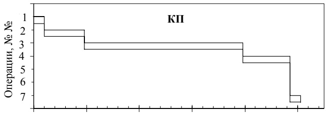
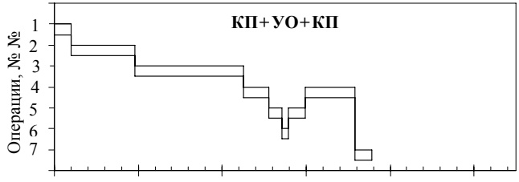
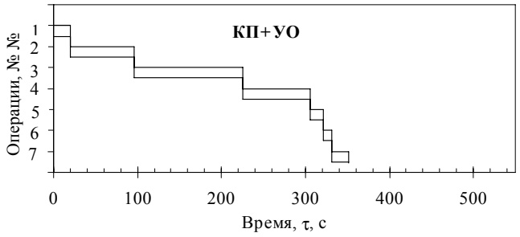
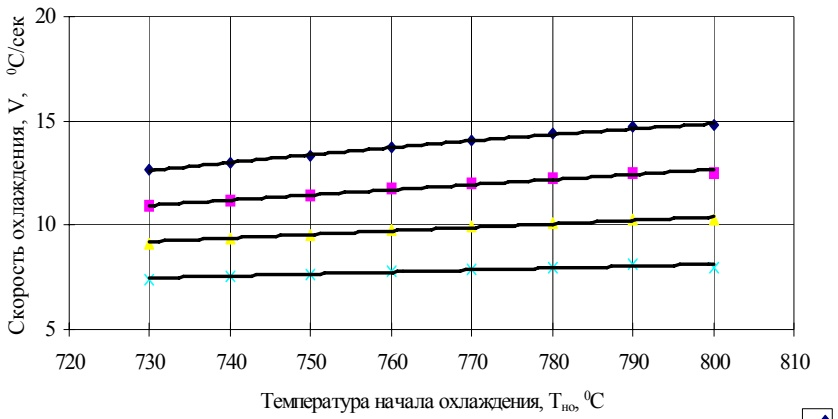

## В. И. Спиваков\*, Э. А. Орлов\*, И. В. Ганошенко\*\*

\*ИЧМ НАН Украины ,\*\*ОАО «МК «Азовсталь»,

## ВЫБОР РАЦИОНАЛЬНОЙ СХЕМЫ КОНТРОЛИРУЕМОЙ ПРОКАТКИ ЛИСТОВ С УСКОРЕННЫМ ОХЛАЖДЕНИЕМ НА РЕВЕРСИВНОМ СТАНЕ

Рассмотрены различные схемы контролируемой прокатки толстых листов (КП) из малоперлитных сталей на реверсивных станах Украины, включая ускоренное ох- лаждение после деформации со скоростями 10–300С/сек. Показано преимущество в условиях стана 3600 «МК «Азовсталь» применение схемы высокотемпературной КП (730–8000С). листов с последующим ускоренным охлаждением , что повышает темп прокатки до 20% в сравнении с низкотемпературной КП (690–7400С).

Контролируемая прокатка (КП) толстых листов является частным случа- ем процесса ТМО преимущественно малоперлитных сталей, содержащих карбо– и нитридообразующие элементы, ее проводят взамен нормализации или улучшения прежде всего для получения мелкого ферритного зерна, что повышает показатели как прочности, так и вязкости стали.

Существующая на реверсивных станах Украины технология низкотемпе- ратурной КП позволяет производить листовой прокат из непрерывнолитых слябов для изготовления труб классов прочности К–56 – К–60 диаметром 1220–1420 мм из низколегированных сталей типа 09Г2ФБ, 10Г2ФБ, 10Г2БТ и др., удовлетворяющих требованиям хладостойкости при строительстве и эксплуатации газопроводов в районах Крайнего Севера [1, 2].

Основной принцип КП заключается в применении более низкой темпера- туры и более высокой степени обжатий в последних проходах, чем при рядо- вой горячей прокатке, с учетом того, что деформация, как способ повышения комплекса механических и эксплуатационных свойств стали:

не эффективна при высоких температурах, т.к. рекристаллизация и рост зерна аустенита протекают между проходами весьма быстро;

一 более эффективна при средних температурах, т.к. после рекристал- лизации (частичной или полной) замедляет рост зерна аустенита;

наиболее эффективна при низких температурах, т.к. зерна аустенита не рекристаллизуются между проходами, подвергаются наклепу благодаря чему из них образуются мелкие зерна феррита.

Технология трехстадийной КП, проводимая последовательно в указан- ных высоких, средних и низких температурах в отличие от рядовой односта- дийной горячей прокатки при высоких температурах, включает корректиров- ку температурно–деформационных параметров прокатки с целью получения повышенного уровня прочностных и вязких свойств в листах из низколеги- рованных сталей.

Указанная корректировка, в основном, сводится к снижению температу- ры нагрева слябов, понижению температуры и повышению обжатий при де- формации в чистовой клети $[ 1 , 2 ]$

Снижение $\mathrm { T _ { \mathrm { K I } } }$ на каждые $1 0 ^ { 0 } \mathbf { C }$ приводит к увеличению прочности на 10– $1 5 ~ \mathrm { H / M M } ^ { 2 }$ малоперлитных ниобиевых сталей, что означает уменьшение рас- хода Nb или V на 0,01–0,02% [1].

Основным условием при котором проявляется эффект КП, как способ измельчения зерна аустенита путем рекристаллизации, является необходи- мость завершения деформации в чистовой клети стана при температуре выше $\mathbf { A r } _ { 3 }$ , причем часть суммарной деформации должна происходить в нижней ау- стенитной области и в межкритическом интервале температур.

Однако, при обжатиях в межкритическом интервале температур хотя и повышаются прочностные характеристики, показатели пластичности и вяз- кости снижаются, что может быть частично компенсировано низким содер- жанием углерода, серы (до 0,005%), вакуумированием и другими мероприя- тиями, направленными на улучшение качества непрерывнолитого металла.

Соблюдение требуемого низкотемпературного режима КП для получения заданного уровня свойств вызывает определенные затруднения в производ- ственной практике, что связано, прежде всего, с обеспечением заданной про- изводительности стана и безаварийности его работы.

Трудности возникают в связи с тем, что в черновой клети сляб может быть прокатан с высокой скоростью и далее находиться в очереди, охлажда- ясь до заданной температуры начала прокатки в чистовой клети $\mathrm{T_H} = 750 -$ $7 0 0 ^ { 0 } \mathrm { C ) }$ , которая должна работать непрерывно.

При существующей низкотемпературной технологии КП листов из мало- перлитных сталей для магистральных трубопроводов охлаждение раскатов до заданной $\mathrm { T _ { H } }$ производят, как правило, на воздухе, а число проходов опти- мизируется исходя из времени пауз (выдержек) по разработанным темпера- турным моделям.

Такой процесс, реализованный на современных мощных толстолистовых станах 5000 фирмы Mannesman–rohren (ФРГ), 4200 фирмы Voest – Alpine (Австрия), 4500 фирмы Posko (Ю. Корея) и на стане 3000 МК им. «Ильича» (г. Мариуполь) включает чередование процессов деформации металла и его охлаждения до заданной температуры, т.е. КП с одной выдержкой раскатов для охлаждения на воздухе. Возможен процесс КП с двумя выдержками для охлаждения или с повторным рекристаллизационным нагревом подката [3, 4].

Существующая технология контролируемой прокатки на реверсивном стане 3600 ОАО «МК «Азовсталь» включает нагрев слябов до $\bar { 1 } 1 5 \bar { 0 ^ { 0 } } \mathrm { C } _ { \mathrm { i } }$ тем- пературу конца прокатки в чистовой клети при $7 \dot { 1 } 0 { - } 7 4 0 ^ { 0 } \mathrm { C }$ (в зависимости от углеродного эквивалента) при толщине подката 50 мм после черновой клети и обжатия в чистовой клети 15–18% в каждом проходе и 3 последних по 10% для обеспечения плоскостности.

Такой режим прокатки, с одной стороны вызывают повышенные нагруз- ки на клеть и привод валков, повышают расход энергии и снижают произво- дительность стана, а с другой– его осуществление ограничивается пластич- ностью металла, прочностью деталей прокатного стана и мощностью приво- да.

Рассмотрим возможные схемы КП, в том числе альтернативные, с при- менением ускоренного охлаждения, в потоке стана 3600 ОАО «МК «Азов- сталь» (рис.1).

Рис. 1. Порядок и про- должительность техно- логических операций контролируемой про- катки по различным схемам

1 — транспорти- ровка слябов от мето- дических печей до чер- новой клети;

2 — прокатка в черновой клети;

охлаждение подкатов на воздухе пе- ред прокаткой в чисто- вой клети;

4 — прокатка в чистовой клети;

5 — транспорти- ровка раскатов к уста- новке УОВТ или обрат- но к чистовой клети;

6 一 ускоренное охлаждение раскатов в установке УОВТ;

7 — охлаждение раскатов на воздухе по- сле КП или КПУО.

В условиях стана 3600 процесс рядовой КП (рис. 1а) включает выдержку подкатов на воздухе после черновой прокатки при реверсивном покачивании на промежуточном рольганге. При отработанной технологии низкотемпера- турной КП листов, толщиной 16–20 мм, длительность охлаждения (выдерж- ки) подката толщиной около 50мм до достижения заданной температуры прокатки на участке между клетями составляет около 300 с, что значительно превышает обычный темп горячей прокатки [2].

Длительность выдержки подката на воздухе в основном зависит от его толщины а снижение производительности при установившейся технологии низкотемпературной КП достигает 25–33% [1, 2, 3]. Повышение производи- тельности за счет снижения выдержки подкатов при охлаждении их между клетями прямо связано с применением высокотемпературной КП и ускорен- ного охлаждения подкатов (рис.1б) или готовых листов после прокатки (рис.1в).

При выборе рациональной схемы КПУО, применительно к малоперлит- ным сталям с Nb (до 0,03%) следует отметить необходимость соблюдения нескольких основных условий:

температура деформации должна находиться в интервале 1000– $8 5 0 ^ { 0 } \mathrm { C } _ { \mathrm { z } }$ поскольку при более высоких температурах деформации $( \mathrm { ~ \bf ~ T _ { \kappa \pi } ~ } >$ $1 0 0 0 ^ { 0 } \mathrm { C ) }$ измельчение зерна феррита не происходит, хотя структура аустенита и гомогенизируется, препятствуя образованию структуры видманштетта, при ускоренном охлаждении;

при снижении $\mathrm { T } _ { \mathrm { \kappa \pi } } \mathrm { \pi o } ~ 8 5 0 ^ { 0 } \mathrm { C }$ зерно феррита измельчается, растет проч- ность $( \sigma _ { m } ,   \sigma _ { e } ) ,   \mathrm { T _ { x p } }$ снижается.

Таким образом, верхний диапазон температур КПУО может находиться в пределах $8 5 0 { - } 1 0 5 0 ^ { 0 } \mathrm { C }$ или при известном химическом составе в интервале температур $\mathrm{Ac}_{3}+40-50^{\circ}\mathrm{C}_{2}$ а нижний предел определяется принятой схемой КПУО в условиях конкретного стана.

Для выбора рациональной схемы процесса КПУО на реверсивном стане 3600 рассмотрели различные способы достижения требуемой температуры высокотемпературной КП и механических свойств за счет:

а) снижения температуры нагрева слябов;

б) охлаждения подката в процессе прокатки в черновой клети;

в) охлаждения подката на установке УОВТ после 5–ти проходов в чисто- вой клети с последующим возвратом для завершающих 3 проходов –(1–я схема КП+УО+КП, рис.1 б);

г) охлаждения подката перед чистовой клетью на воздухе до повышен- ных температур КП, прокатки за 8 проходов и ускоренного охлаждения рас- ката на установке УОВТ до температуры, необходимой для обеспечения за- данного комплекса свойств и плоскостности (2–я схема $\mathrm{KII{+}VO_{2}}$ , рис. 1в).

Поскольку существующая технология низкотемпературной КП связана с потерей времени на получение заданной температуры начала прокатки, то одной из главных задач является <u>уменьшение времени выдержки раскатов</u> на воздухе перед их деформацией.

Рассмотрим указанные схемы с этой точки зрения, а также с учетом воз- можной их реализации на стане 3600.

Снижение температуры нагрева слябов $\mathrm { c } ~ 1 1 5 0 \mathrm { - } 1 1 0 0 ^ { \circ } \mathrm { C }$ до $1 0 5 0 ^ { 0 } \mathrm { C }$ являет- ся необходимым и легко реализуемым мероприятием, позволяющим к тому же снизить тепловые энергозатраты на нагрев металла.

Охлаждение подката в процессе прокатки в черновой клети и (или) на промежуточном рольганге стана невозможно без создания специализирован- ных охлаждающих средств и является малоэффективным из–за большой тол- щины и опасности подстуживания угловых и кромочных зон раската.

Охлаждение подката на установке УОВТ до требуемых температур КП после 3–5–ти проходов в чистовой клети с последующим возвратом для за- вершающих 3 проходов, т.е. 1–я схема КП+УО+КП, технически возможно и может быть рекомендовано для опробования и практической реализации.

Следует отметить, что при этом варианте КПУО нагрузки в клети могут не уменьшиться, но явным преимуществом его является уменьшение дли- тельности выдержки раскатов перед завершающей стадией прокатки.

Охлаждение подката при выдержке на воздухе перед чистовой клетью до температур выше (на $3 0 { - } 5 0 ^ { 0 } \mathrm { C ) }$ , чем при существующей низкотемпературной КП, т. е. 2–я схема КП+УО, является также приемлемым, поскольку само по- вышение температуры КП в чистовой клети предполагает снижение выдерж- ки подката на воздухе для ее достижения. Ориентировочно выдержка на воз- духе подката 50 мм уменьшится с 300 с до 150–200 с, снижаются нагрузки в чистовой клети а потеря прочности стали будет компенсирована применени- ем УО.

Оба приемлемых для реализации схемы КПУО необходимо рассмотреть с точки зрения выбора такой из них, при которой <u>выдержка для достижения</u> требуемой температуры начала и конца чистовой прокатки является мини- <u>мальной.</u>

Возможность повышения этих температур по сравнению с рядовой КП при условии последующего УО (2–я схема КП+УО) будет определять уро- вень снижения выдержки и повышения производительности стана при КПУО.

Для малоперлитных сталей с карбонитридным упрочнением сортамента стана 3600 (09Г2ФБ, 10Г2ФБ) с учетом углеродного эквивалента верхний предел начала высокотемпературной КП с ускоренным охлаждением (КПУО) может быть предварительно установлен после расчета значений $\mathrm { A c } _ { 3 }$ для кон- кретного состава плавки по известным уравнениям [5].

Нижний предел температуры конца прокатки при КПУО может быть выше на $3 0 { - } 5 \dot { 0 } ^ { 0 } \mathrm { C }$ принятого диапазона температур низкотемпературной КП [1] сталей типа 09–10Г2ФБ, т.е. составлять $7 3 0 - 8 0 0 ^ { \circ } C$ при последующем УО.

Температура конца принудительного охлаждения раскатов на УОВТ по- сле прокатки должна быть не ниже $5 0 0 { - } 5 5 0 ^ { 0 } \mathrm { C }$ для обеспечения плоскостно- сти раскатов и избежания появления мартенситной фазы, что потребует до- полнительного отпуска листов.

Такой режим вызывает повышение $\mathfrak { S } _ { \mathrm { T } }$ и $\mathbf { \mathfrak { S } _ { B } }$ на 50 $\mathrm { H / { \bf { M M } } ^ { 2 } }$ по сравнению с низкотемпературной КП при толщине листа до 20 мм при требуемых показа- телях пластичности и вязкости металла.

Например, для производства труб диаметром 1420 мм со стенкой 20 мм для магистральных трубопроводов на давление до 100 МПа, работающих в арктических условиях применяют контролируемую прокатку и последующее термическое упрочнение за счет УО от температур выше $\mathbf { A } _ { \mathrm { { r } 3 } }$ до $4 0 0 { - } \dot { 5 } 0 0 ^ { 0 } \mathrm { C }$ в системе многоцелевого ускоренного охлаждения раскатов водой (СМУО), подобной установке УОВТ на стане 3600 [6].

Рассмотрим технические возможности реализации предложенных пара- метров КПУО в условиях станов 3000 МК «им. Ильича» и 3600 «МК «Азов- сталь» (г. Мариуполь) по различным схемам (см. таблицу).

В соответствии с низкотемпературной трехстадийной КП производство трубных сталей с карбонитридным упрочнением осуществляется по следую- щей технологии.

Прокатка в черновых клетях за 8–10 проходов при температурах 1100– $9 0 0 ^ { 0 } \mathrm { C } ^ { \mathrm { { } ^ { \mathrm { { } ^ { \mathrm { { } ^ { } } } } } } }$ , прокатка в чистовой клети за 6–8 проходов с предварительным под- стуживанием подкатов до температур $7 5 0 – 8 2 0 ^ { \circ } \mathrm { C }$ за счет транспортировки по шлепперным холодильникам (стан 3000) или при выдержке подкатов на про- межуточном рольганге (стан 3600). Темп прокатки при этом на стане 3000 почти в два раза выше чем на 3600 за счет его специализации для производ- ства штрипсов способом контролируемой прокатки.

В отличие от стана 3000 на стане 3600 имеется условия для ускоренного охлаждения раскатов что дает возможность осуществить предлагаемые па- раметры режимов высокотемпературной КП (КП+УО+КП и КП+УО) (см.таблицу).

При высокотемпературной КП по этим схемам температурно– деформационный режим прокатки в черновой клети (первая стадия КП) не изменяется а обжатия в чистовой клети (вторая и третья стадии КП) осуще- ствляются при повышенных температурах в сравнении с рядовой КП.

Схема КП+УО+КП предусматривает промежуточное подстуживание рас- ката на УОВТ с $8 2 0  –  8 7 0 ^ { \bar { 0 } } \mathrm { C }$ до $7 0 0 { - } 7 5 0 ^ { \circ } \mathrm { C }$ после первых 5 проходов и возврат к чистовой клети. Последние три прохода до заданной толщины осуществ- ляют с относительным обжатием в каждом пропуске до 10% и суммарным обжатием в этих пропусках не менее 30%.

Схема КП+УО предусматривает прокатку в чистовой клети за 8 проходов при температурах на $3 0 { - } 5 0 ^ { 0 } \mathrm { C }$ выше чем при рядовой КП с последующим ус- коренным охлаждением на УОВТ со скоростью $1 0 { - } 3 0 ^ { 0 } \mathrm { C / c }$ до $5 0 0 { - } \dot { 5 } 5 0 ^ { 0 } \mathrm { C }$

При выборе указанных высокотемпературных схем КПУО 1 и 2 сравнили соответствующие им темпы прокатки листов, который определяет произво- дительность стана (см. рис.1). Анализируя длительность технологических операций указанных схем КП и КПУО заметим, что схема КП+УО является предпочтительной, т.к. длительность прокатки листов в чистовой клети меньше на 50с или более чем в 1,5 раза по сравнению с КП+УО+КП и на 150 с, по сравнению с рядовой низкотемпературной КП.

Таблица. Температурно–деформационные параметры контролируемой прокатки на реверсивных станах по различ- ным схемам

<table><tr><td>-</td><td>KII+yO</td><td>II+O+KII</td><td>KII 3600</td><td>KII</td><td>3000</td><td>x -</td></tr><tr><td>1250</td><td>11501120-</td><td>11501120-</td><td>11501120</td><td>1150-1120-</td><td> $[ \mathrm { T } _ { 0 } , { } ^ { 0 } \mathr</td><td>-T-pa ía-m { C } ]$ 60B</td></tr><tr><td>1200</td><td>1000÷1100</td><td>1000÷1100</td><td>1000÷1100</td><td>1000÷1100</td><td> $\overline { { \mathrm { T _ { \mathrm { H I } } ,</td><td rowspan=4>^ { 0 } C } } }$ athrm { C } } } }</eq>/eq></td></tr><tr><td>1100</td><td>≤980</td><td>≤980</td><td>≤980</td><td>900÷960</td><td> $\overline { { { \mathrm { T } _ { \mathrm { K I I } } ,   ^ { 0 } \m</td></tr><tr><td>5÷6</td><td>o1</td><td>o1</td><td>01</td><td>8</td><td>N</td></tr><tr><td>570÷7</td><td>81,2</td><td></td><td>81,21</td><td>78,4</td><td><eq>\Sigma \varepsilon , \%<</td></tr><tr><td>≥1000</td><td>820÷870</td><td>800÷1050</td><td>770÷82</td><td>0  750÷800</td><td><eq>\overline { { \mathrm { T _ { H I I } ,   ^ {</td><td rowspan=4>0 } C } } }$ athrm { C } } }</eq></td></tr><tr><td>≥850</td><td>730÷800</td><td>690÷740</td><td>690÷74</td><td>0  700÷740</td><td> $\overline { { \mathrm { T _ { K \Pi _ { 2 } } } ^ { 0 } \m</td></tr><tr><td>5÷7</td><td>8</td><td>5+3</td><td>8</td><td>9</td><td>N</td></tr><tr><td>75÷80</td><td>62,8</td><td>62,8</td><td>62,8</td><td>67,</td><td>6∑ε,%</td></tr><tr><td>850÷1000</td><td>720÷790</td><td>820÷870</td><td>690÷740</td><td>700÷740</td><td><eq>\overline { { \mathrm { T _ { \mathrm { H } 0 } ,</td><td rowspan=2>^ { 0 } C } } }$ mathrm { { C } } } } }</eq></td></tr><tr><td></td><td>500÷550</td><td>700÷750</td><td></td><td></td><td><eq>\overline { { { \mathrm { T } _ { \mathrm { { \kappa } } _ { 0 } } ,   ^ { 0 } \</td></tr><tr><td>04</td><td>75÷80</td><td>6</td><td>6</td><td>0</td><td>τ, eκ</td><td>-TemII</td></tr></table>

N – количество проходов; Σε – суммарное обжатие.

Накопленный опыт эксплуатации установки УОВТ на стане 3600 позво- лил на основании многофакторного корреляционно–регрессионного анализа выборки ДТУ листов (300 экспериментов с листами толщиной 10–32мм, око- ло 40 плавок) разработать интегральную теплотехническую модель процесса ускоренного охлаждения на установке [8]:

$$
\mathbf{G}_{\mathrm{e}}[\mathrm{u}^{3}/\mathrm{trace}]=870-1076(\mathrm{T}_{\mathrm{s}}\mathrm{cp}\mathrm{u}-\mathrm{T}_{\mathrm{c}})/(\mathrm{T}_{0}-\mathrm{T}_{\mathrm{c}})+6.65(\mathrm{S}-1)\delta+0.164G_{\mathrm{u}}
$$

**G**<strong>в</strong>**, G**<strong>н</strong> — расходы воды соответственно на верхние и нижние охлаждаю- щие устройства;

**Т**<strong>0</strong>**,** $\bf { T } _ { 3 c p u }$ и **Т**<strong>с</strong> — соответственно температуры начала охлаждения раската, заданная среднемассовая и охлаждающей среды $\left( \mathrm{BO} \right\bot \mathrm{bI} ), \mathrm{C};$

S — значение шкалы сельсинового команд–аппарата (сельсин);

— толщина охлаждаемого раската, мм.

Разработанная модель позволяет по заданным технологическим парамет- рам установки $( S , \mathrm { T _ { c } , G _ { n } } )$ , входным параметрам раската $( \mathrm { T } _ { 0 } \; , \; \delta )$ и заданной среднемассовой температуре $( \mathrm { T } _ { 3 \mathrm { \Large ~ c p u } } )$ , задаваемой исходя из необходимого комплекса механических свойств охлаждаемого проката, рассчитать расход воды на верхние охлаждающие устройства $( G _ { \mathrm { { B } } } )$ , обеспечивающий получение $\mathrm { T } _ { \mathrm { 3 \; c p w } }$ и оценить технологические возможности установки УОВТ при исполь- зовании ее в процессе КПУО (рис.2).

Рис. 2. Зависимость среднемассовой скорости охлаждения на установке УОВТ раска- тов толщиной 18,7 мм от температуры То до $5 0 0 ^ { 0 } \mathbf { C }$ при различных расходах воды: Цифрами около кривых указан расход воды на верхние охлаждающие устройства в $\mathbf { \hat { \mu } } ^ { 3 / \mathbf { \hat { \mu } } } \mathbf { \hat { \mu } } \mathbf { \hat { \mu } } .$

На рис.2 приведены результаты расчета среднемассовой скорости охлаж- дения листов толщиной 18,7 мм от температур $800-730^{\circ}C\ \pi o\ 500^{\circ}C$ при раз- личных расходах воды на верхние $( G _ { \mathrm { { B } } } )$ и постоянном расходе на нижние $( G _ { \mathrm { H } }$ $1500\  M ^3/� ac$ охлаждающие устройства. Из приведенных результатов видно, что скорости охлаждения достигаемые на установке УОВТ в температурном интервале процесса КПУО соответствуют сформулированным выше требо- ваниям по скорости и длительности охлаждения.

Проведенный анализ, показал преимущество применения в условиях ста- на 3600 для листов из малоперлитных сталей схемы высокотемпературной КП $( 7 3 0 { - } 8 0 0 ^ { 0 } \mathrm { C } )$ с последующим ускоренным охлаждением, что повышает темп прокатки до 20% в сравнении с низкотемпературной КП $( 6 9 0 { - } 7 4 0 ^ { 0 } \mathrm { C } )$

1. Контролируемая прокатка / В.И. Погоржельский, Д.А. Литвиненко, Ю.И.Мат- росов и др. // М.: Металлургия, 1979. С. 183.

2. Погоржельский В.И. Контролируемая прокатка непрерывнолитого металла. М.: Металлургия, 1986. С. 150.

3. Елесина О.П. Состояние и перспективы развития упрочнения толстолистового проката. (Обзор по системе «Информсталь»). М.: Ин–т «Черметинформация», 1986. Вып. 15. С. 32

4. Влияние процесса прокатки и способа охлаждения на структуру толстых листов. / J. Degenkolbe, U. Schriever / Walzverfahren und Kuhlmathode beeinflussen die Gefugeausbild – und bei der Grobblechherstellung, // Maschinenmark. 1988. № 44. С. 66 –71.

5. Структура конструкционной легированной стали. / Б.Б. Винокур и др. // М.: Ме- таллургия, 1979. С. 183.

6. Материалы симпозиума фирмы «Кавасаки сейтэцу», М., 1984, октябрь. (ЭИ трубное и метизное производство, металловедение и термообработка, 1984, вып. 22).

7. Современные тенденции использования высокопрочной судостроительной стали. Новые методы производства. / И. Ватанабэ и др.// «Нихон дзосэн гаккайси». «Bull. Soc. Nav. Archit. Jap.». 1983. ¹ 649. P. 374–386.

8. Разработка регулируемых в широких пределах параметров термомеханического упрочнения плоского проката, обеспечивающих стабильность свойств стали раз- личных уровней прочности и создание методов программного управления про- цессом. Отчет о НИР (Заключительный)/ ИЧМ; руководитель В.И. Спиваков. Днепропетровск, 1994. — 76 с.