# Controlled rolling of steel plate and strip

## T. Tanaka

The major purpose of controlled rolling is to refine grain structure and, thereby, to enhance both the strength and toughness of steel in the as-hot-rolled condition. If a survey is made of the development of controlled rolling, it can be seen that controlled rolling consists of three stages: (a) deformation in the recrystallization region at high temperatures; (b) deformation in the non-recrystallization region within a low temperature range above $A r _ { 3 } ;$ and (c) deformation in the austenite—ferrite region. It is stressed that the importance of deformation in the non-recrystallization region is in dividing an austenite grain into several blocks by the introduction of deformation bands within it. Deformation in the austenite—ferrite region gives a mixed structure consisting of equiaxed grains and subgrains after transformation and, thereby, it increases further the strength and toughness. The fundamental difference between conventionally hot-rolled and controlled-rolled steels lies in the fact that the nucleation of ferrite occurs exclusively at austenite grain boundaries in the former, while it occurs in the grain interior as well as at grain boundaries in the latter, leading to a more refined grain structure. In controlled-rolled steel a crystallographic texture develops, which causes planar anisotropies in mechanical properties and embrittlement in the through-thickness direction. The latter is shown to be the main cause of the delamination which appeared in the frac tured Charpy specimens. Fundamental aspects of controlled rolling, such as the recrystallization behaviour of austenite, the retardation mechanism of austenite recrystallization due to niobium, microstructural changes accompanying deformation, factors governing strength and toughness, etc., are reviewed. The practice of controlled rolling in plate and strip mills is outlined. IMR/79

## HISTORICAL SURVEY

Controlled rolling is a means of improving the properties of steel in the hot-rolled condition to a level equivalent to, or greater than those of highly alloyed or heat-treated steels. Modern controlled rolling has been practised on numerous mill and laboratory experiments which have been performed to obtain high strength, good toughness, and good weldability. The basic idea is to control the rolling process in order to refine the austenite structure, and thereby to give fine ferrite grains.

In 1924 Arrowsmith1 had already pointed out the advantage of grain refinement. It has been known for many years that improvements in mechanical properties result when structural steels are rolled to low finishing temperatures.2 Hanemann and Lucke³ interpreted this in terms of recrystallization after hot deformation with the α-grain size being reduced with decreasing deformation temperature in the γ-region. In 1947 Barr and Tipper4 showed that in mild steel plates the ductile-to-brittle transition temperature was raised by an increase in α-grain size. Examining as-rolled plates, Mackenzie⁵ showed a correlation between transition temperature and finish-rolling temperature, a factor affecting γ-grain size. Similar results have been reported by other investigators.6-11 The above reports have one factor in common: hot rolling was carried out as usual at high temperatures, and only the last one or two passes were rolled at a lower temperature. Therefore, the results obtained were not always definite, and were in disagreement with each other.

After World War 2, in order to prevent the occurrence of brittle fracture, notch toughness was required in shipbuilding and in other structural steel plates. In general, the refinements of microstructure by Al killing, normalizing, and an increase in the ratio of manganese to carbon content were adopted to meet the requirement for notch toughness. Instead of normalizing, however, controlled low-temperature hot rolling was being practised by some mills in Europe to provide increased notch toughness in hot-rolled plate.12 The practice involved making the last few hotrolling passes at temperatures lower than normal. The optimum temperature for the last pass was just above the Ar3 temperature. This rolling schedule was fairly similar to the present controlled rolling and its prototype.

In 1959, Beiser13 reported that the small addition of Nb caused a large increase in strength but reduced notch toughness markedly in as-hotrolled steel plates. It was Great Lakes Steel14 which produced as-hot-rolled high-strength Nbbearing steels for the first time in 1960. In order to prevent a deterioration in notch toughness, the application of controlled rolling to Nb-bearing steel was studied. According to Norén's review15:

<small>Dr T. Tanaka is with the Mizushima Laboratory, Research Laboratories, Kawasaki Steel Corporation, Kurashiki, Japan.</small>

(i) when hot rolled under conventional rolling conditions, Nb steel deteriorated markedly in toughness; (ii) when finish rolled at lower temperatures, the improvement in toughness was much greater for Nb steel than for Nb-free steel; and (iii) when finish rolled below $\mathbf { 8 0 0 ^ { \circ } C _ { \circ } }$ or when total reduction below $\mathbf { 9 0 0 ^ { \circ } C }$ was more than $3 0 \% ,$ notch toughness improved remarkably. The strength increase resulting from the addition of Nb was found to be due to precipitation hardening of fine Nb(C, N) which formed in the α-matrix during cooling.16 In order to make full use of precipitation hardening, Nb(C, N) had to be dissolved at a high temperature before hot rolling, which coarsened the γ-grain structure. When coarse γ was hot rolled conventionally, the transformed structure was a mixture consisting of coarse α and bainite, thereby deteriorating notch toughness. Using these methods, the basis of combining controlled rolling with Nb steel was established.

Research on controlled rolling was carried out by the BISRA group in the 1960s, which opened the way for the development of the present controlledrolling technology. It is difficult to pinpoint the beginning, but the development of $\mathrm{C}-\mathrm{Mn}-\mathrm{Nb}$ finegrained steel commenced about 1958.17 Duckworth et $a l . ^ { 1 8 }$ showed that with the C content below 0.1%, and by using Nb additions and a low finishing temperature with heavy draughting, very attractive properties could be obtained in the as-rolled condition. Pearlite-free steel19and pearlite-reduced steel18 proposed by Duckworth et al. were intended to improve weldability and toughness by reducing the C content, to increase strength by additions of Nb and/or V, and to improve toughness by using a low finishing temperature. It was Phillips and Chapman,20 Irani et $a l . . . ^ { 2 1 }$ and Jones and Rothwell22who, for the first time, turned their attention to controlled rolling itself. They showed that Nb retarded recrystallization greatly, thereby enabling the deformation of γ in the non-recrystallization region, that transformation from deformed γ produced a fine α-grain structure, and that an improper draught schedule tended to cause a mixed grain structure. However, because their experiments were carried out in a laboratory bar mill, and the only measure of controlled rolling was the finishing temperature, their results lacked generality.

Research on controlled rolling motivated by the BISRA group has been undertaken very actively, including fundamental and applied aspects. Fundamental aspects include items such as the recrystalization behaviour of $\gamma , ^ { 2 3 - 2 9 }$ the retardation mechanism of recrystallization due to $\mathrm{Nb},^{22,30,31}$ microstructural change accompanying deformation in the non-recrystallization γ-region²7,32-34and its influence on transformation behaviour,34,35 and factors governing grain structure after transformation.33,34

Through these investigations, the importance of deformation in the non-recrystallization region was recognized. It was also made clear that controlled rolling was not to cease in the γ-region, but was to be extended into the γ—α-region, thereby enhancing both strength and toughness.27,36,37 Modern controlled rolling means the overall technology consisting of (i) a suitable selection of chemical composition, (ii) a proper slab-reheating temperature to obtain small and uniform γ-grains, (iii) γ-grain refinement owing to repeated deformation recrystallization, (iv) deformation in the non-recrystallization region, (v) deformation in the γ—α two-phase region, and (vi) controlled cooling.

The full-scale production of controlled-rolled plates and hot-rolled strip commenced with the construction of large-diameter pipelines, which required high-strength steel with good toughness and weldability. In fact, pipelines applied to Arctic-temperature service were impossible to construct without controlled-rolled plates.

Finally, the great contribution from Hall and Petch must be recognized. The Hall-Petch relation8 correlates yield stress with ferrite grain size. Heslop and Petch9 also associated transition temperature with grain size; they guided the development of controlled rolling throughout its whole course.

## FUNDAMENTALS OF CONTROLLED ROLLING

The major purpose of controlled rolling is to refine the structure of steel and, thereby, to enhance both strength and toughness. Because of the relation between γ- and α-grain sizes, refinement of the α-structure is achieved mainly through γ- grain refinement. The change in grain structure with deformation temperature has been studied by many investigators.25,27,33,37-43 Many studies were confined to deformation in the γ-region alone,25,33,38-41 while few of them were extended to deformation in the γ—α two-phase region.27,37,42,43

Kozasu et al. 25 divided deformation temperatures in the γ-region into three ranges in association with the change in γ- and α-grain structures. Deformation above $\mathbf { 1 0 0 0 ^ { \circ } C }$ brings about coarse, recrystallized γ-grains, which transform to a relatively coarse α and upper bainitic structure (range 1). Deformation in the intermediate temperature range from 1000° to 900°C refines γ by repeated recrystallization, leading to fine-grained α (range 2). Deformation below the recrystallization temperature produces 'warm-worked'γ, which leads to a finer α-grain structure (range 3). The grain refinement is achieved mainly by deformation in ranges 2 and 3.40 The transition temperature was shown to decrease in a linear manner with an increase in total reduction in ranges 2 and 3.40

From a practical viewpoint, Baird and Preston38 proposed a similar but slightly different interpretation. Figure 1 depicts the rolling procedures involving reduction in the rapid-recrystallization region (range 1), delay in rolling (in range

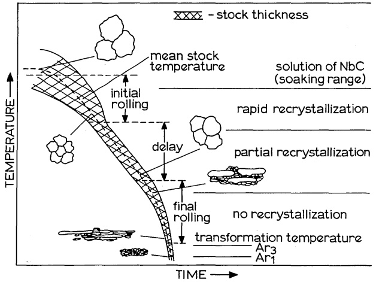

1 Schematic representation of various processes taking place during controlled rolling of C Mn—Nb steels; after Baird and Preston38

2), and final reduction in the non-recrystallization region (range 3). Delay in rolling is a necessary procedure for ensuring the required amount of deformation in the non-recrystallization region. During the delay, however, partial recrystallization tends to occur, thereby leading to the formation of a mixed grain structure.

According to Fukuda et al.,33,44 there are two types of austenite-to-ferrite transformation mode during hot rolling, shown in Fig. 2. Type 1 is the transformation from recrystallized γ to α, where α nucleation takes place exclusively at recrystallized γ-grain boundaries. Type 1 is subdivided into two, A and B: type 1A and 1B are equivalent to range 1 and 2 above, respectively. Rolling passes at high temperatures do not contribute to the refinement of the γ-grain structure (γ-grain size ASTM 5), which transforms to a coarse α and/or Widmanstätten-like structure (type 1A). Deformation at low temperatures in the recrystallization region prouces a fine-grained γ-structure (γ- grain size ≥ ASTM 6), which transforms to a finegrained ferrite—pearlite structure (type 1B). Type 2 is the transformation mode from unrecrystallized γ to α, where α nucleation occurs at grain interiors

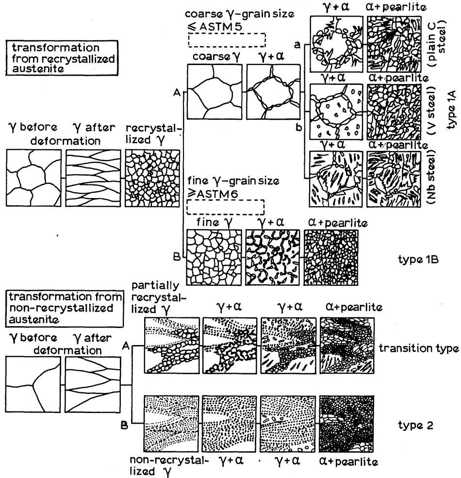

2 Schematic diagram of types of austenite-to-ferrite transformation for hot-worked steel; after Fukuda et al.33,44

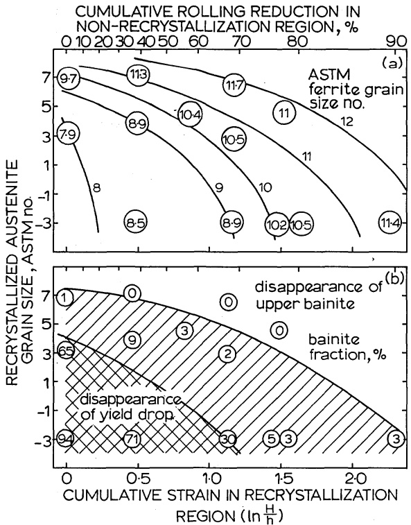

3 Effect of recrystallized austenite grain size and total reduction in non-recrystallization region on a ferrite grain size and b upper bainite fraction in Mn—Nb—V steel; after Sekine and Maruyama41

as well as at grain boundaries, and whereby ultrafine α-grains are obtained. The transition type is in the intermediate mode between types 1 and 2, giving a mixed grain structure. When a comparison is made, the finest α-grain is obtained by type 2, followed by type 1B, transition type, and type 1A. However, α-grain structure is more homogeneous for type 1B than for type 2.

Sekine and Maruyama41 showed that α-grain structure is decided by the recrystallized γ-grain size before deformation in the non-recrystallization region and the amount of deformation in that region. Figure 3 depicts the effect of total reduction in the non-recrystallization region on α-grain size (Fig. 3a) and upper bainite volume fraction (Fig. 3b). When a recrystallized γ-grain size is large, it is difficult to suppress the formation of upper bainite even by large deformation. However, when the recrystallized grain size is small, upper bainite is not allowed to form, even with moderate deformation, giving fine-grained α. Sekine and Maruyama4i emphasized that the best way is to refine γ through recrystallization as much as possible (type 1B), followed by deformation in the non-recrystallization region (type 2) and whereby a uniform, fine-grained α-structure is produced.

The difference between Fukuda et al.33 and Sekine and Maruyama41 is that the former stressed type 2 to achieve a fine-grained α-structure, whereas the latter emphasized the importance of the combination of types 1B and 2. This argument is, however, reduced to the uniformity of α nucleation within unrecrystallized γ-grains which, in turn, is reduced to the uniformity in deformationband density throughout unrecrystallized grains, since α nucleates on deformation bands as well as at γ-grain boundaries. There has been some evidence that deformation-band density has the propensity to be heterogeneous and that not all the deformation bands have the same ferrite-nucleating potential,34,41 suggesting that type 2 tends to produce a mixed α-grain structure compared with the optimum combination of types 1B and 2.

So far, controlled rolling has been confined to deformation in the γ-region. Coleman et $a l . ^ { 3 7 }$ and Gladman and Dulieu42obtained a further increase in strength by extending deformation into the γ + α and/or α-regions, and by developing a substructure. Advancing this idea, Tanaka et al.27,45 proposed the three stages of the controlled-rolling process: (i) deformation in the γ-recrystallization region, (ii) deformation in the non-recrystallization region, and (iii) deformation in the γ—α two-phase region.

Figure 4 illustrates schematically the three stages of the controlled-rolling process, and the microstructural change accompanying deformation in each stage. Stage 1: coarse austenite a is refined by repeated deformation and recrystallization b, but still transforms to relatively coarse ferrite

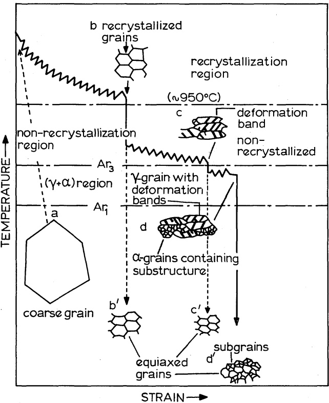

4 Schematic illustration of three stages of controlled-rolling process and change in microstructure with deformation in each stage; after Tanaka43

$b ^ { \prime } ;$ stage 2: deformation bands are formed in elongated, unrecrystallized austenite $c ,$ and ferrite nucleates on the deformation bands as well as γ- grain boundaries, giving fine α $c ^ { \prime } ;$ stage ${ \pmb { \mathfrak { Z } } } ;$ deformation in the $\gamma { - } \alpha$ two-phase region continues stage 2 and also deforms the ferrit $\mathbf { : e , }$ producing a substructure $d .$ , During cooling after deformation, unrecrystallized austenite transforms to equiaxed α-grains, while deformed ferrite changes into subgrains $d ^ { \prime } ,$

Grain refinement through repeated recrystallization does not proceed indefinitely but reaches a certain limiting value b and thereby results in relatively coarse α-grains $b ^ { \prime }$ . A means of breaking the limiting value is to divide the γ-grain. Since a recrystallized $\gamma -$ grain b is divided by deformation bands $c ,$ the final α-grain structure is much smaller for $c ^ { \prime }$ than for $b ^ { \prime }$ . The deformation in the two-phase region causes further grain refinement and a mixed structure consisting of equiaxed grains and subgrains. Additional strengthening is obtained by subgrain hardening.

The fundamental difference between conventional hot rolling and controlled rolling lies in that, in the former, α nucleates exclusively at γ-grain boundaries, whereas in the latter α nucleation occurs at grain interiors as well as grain boundaries, which leads to a large difference in the final α-grain structure between the two. The fact that the deformation band is equivalent to the γ-grain boundary with regard to ferrite-nucleating potentiality, means that a γ-grain is divided into several blocks by deformation bands. A comparison between conventional hot rolling and controlled rolling is very similar to that between normalizing and quenching. In conventionally hot-rolled and normalized steeis, α nucleates exclusively at γ-grain boundaries, which limits grain refinement, whereas in controlled-rolled and quenched steels, the $\gamma -$ grain is divided into several blocks; the former is by deformation bands and the latter by martensitic transformation, producing a much finer grain structure.43

Since unrecrystallized $\gamma$ containing deformation bands promotes the γ to α transformation, from a different viewpoint, controlled rolling can be defined as a process for accelerating α transformation and thereby for producing fine-grained α in steel with medium hardenability which, without being controlled rolled, will transform to a bainitic structure, giving poor toughness.

The effect of each stage deformation on microstructure and mechanical properties is described below.

## DEFORMATION IN RECRYSTALLIZATION REGION

## Dynamic recrystallization

There are two kinds of restoration process associated with hot working, dynamic and static.46 When

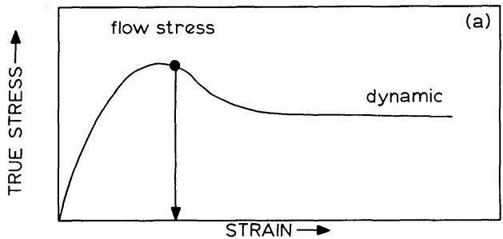

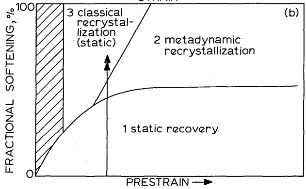

5 Schematic representation of a stress—strain curve and b of inter-relation between three softening mechanisms and of dependence on strain of softening proportions attributable to each mechanism; hatched area is forbidden zone; after Djaic and Jonas47

steel is deformed in the austenitic state at high temperatures, the flow stress rises to a maximum and then falls to a steady state, see Fig. 5a. In a range of strain less than that for the peak stress dynamic recovery operates, while in the steadystate region dynamic recrystallization occurs. The structures developed by dynamic restoration are thermodynamically unstable, and when held at temperature they are modified by the staticrestoration process. Three static-restoration processes can be operative, static recovery, static recrystallization, and metadynamic (post-dynamic) recrystallization, see Fig. 5b.

The dynamically recrystallized grain size d is associated with the Zener-Hollomon parameter $Z ,$ which is a temperature-compensated strain rate, and is given by the following equations48:

$$
d ^ { - 1 } \propto \sigma _ { \mathrm { f l o w } } \propto \log Z \quad . \quad . \quad . \quad . \quad .\tag{1}
$$

$$
Z = \xi \exp \left( Q _ { \mathrm { d i f f } } / R T \right) . \ . \ . \ . \ . \ .\tag{2}
$$

where è is the strain rate, $\mathbf { Q _ { d i f } }$ is the activation energy for the self-diffusion of iron, R is the gas constant, and $T$ is absolute temperature. This relation was found to exist for Nb steel hot rolled under a certain condition, shown in Fig.6. However, since a critical strain for the onset of steady state is very large, even at high temperatures,46,48 it is almost impossible to hot roll steel, and in particular Nb steel, in the steady-state region. This

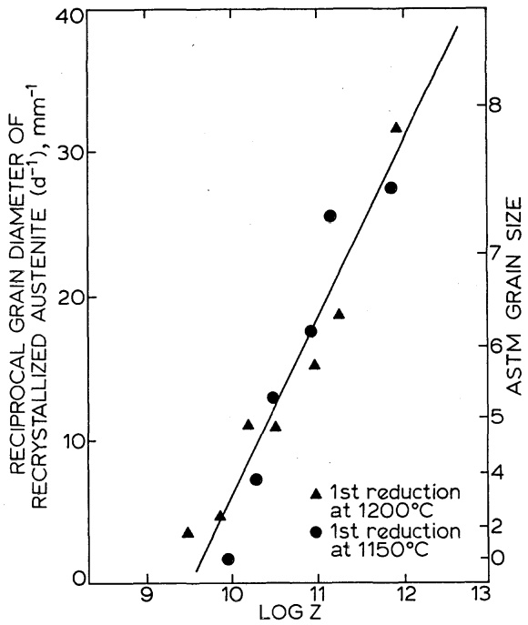

6 Relation between Zener-Hollomon parameter and reciprocal of recrystallized austenite grain size in Nb steel; after Sekine and Maruyama26

means, in turn, that it is almost impossible to refine the γ-grain through dynamic recrystallization. Instead, grain refinement must be achieved by static recrystallization.

## Static recrystallization

Static recrystallization accompanying hot deformation proceeds in a similar manner to that in coldworked material. Nucleation sites for new grains are predominantly triple junctions of grains and grain boundaries, and nucleation within grains is almost nil.25 The distribution of nuclei is highly localized and inhomogeneous; while some grain boundaries give rise to numerous nuclei, there are boundaries where nuclei are completely absent.25 The progress of recrystallization after nucleation is essentially the migration of the recrystallizing front into deformed matrix as is usual in recrystallization. The completion of recrystallization is followed by normal grain growth.

Effects of the amount of deformation and deformation temperature on recrystallized grain size are shown in Fig.7. The recrystallized grain size decreases rapidly as the amount of reduction increases, reaching a limiting value.27 The limiting grain size decreases with reducing initial grain size.49Although a lower deformation temperature produces smaller grain sizes, the effect of temperature is slight. Figure 8 depicts γ-grain refinement in C—Mn and C—Mn—Nb steels during continuous rolling, and it is seen that the grain size decreases from ASTM No.—2 to 7 during rolling over the temperature range 1250°—850°C.

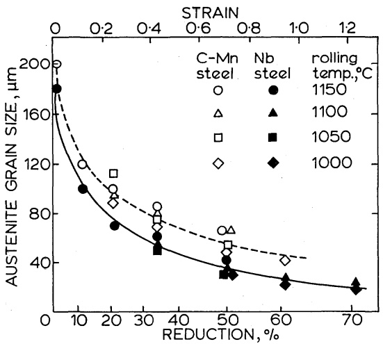

7 Influence of amount of single-pass deformation and deformation temperature on recrystallized austenite grain size in plain C and Nb steels; after Tanaka et al.27

Since nucleation sites for recrystallization are predominantly at the grain boundaries, 25 the initial grain size plays an important role in determining recrystallized grain size. Ouchi et al.49 showed that recrystallized grain size decreases in a linear manner with the product of strain and total grain-boundary area. Using stainless steel, Towle and Gladman50 showed that recrystallized grain size $d _ { \mathbf { r e x } }$ can be expressed by

$$
d _ { \mathrm { r e x } } = k \epsilon ^ { - 0 . 5 } d _ { 0 } Z ^ { - 0 . 0 6 } \quad . \quad . \quad . \quad .\tag{3}
$$

where k is a constant, ε is the amount of strain, $d _ { 0 }$ is the initial grain size, and Z is the Zener— Hollomon parameter. Equation (3) also indicates the slight effect of strain rate on recrystallized grain size.

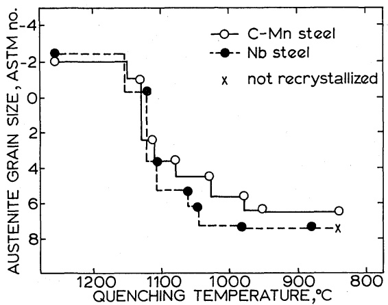

Variation in recrystallized austenite grain size with rolling pass in plain C and Nb steels; steels were quenched following hot rolling; after Sekine and Maruyama26

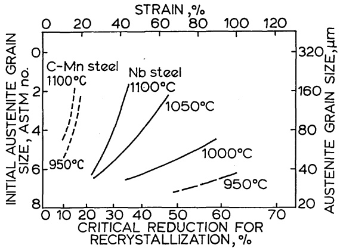

9 Effects of deformation temperature and initial grain size on critical amount of deformation required for completion of recrystallization in plain C and Nb steels; after Tanaka et al.27

## Conditions for recrystallization

Taking static recrystallization after hot deformation as a prerequisite condition, the effects of various factors on recrystallized grain size have been described so far. It must be stressed, however, that static recrystallization accompanying hot deformation does not occur under all conditions.

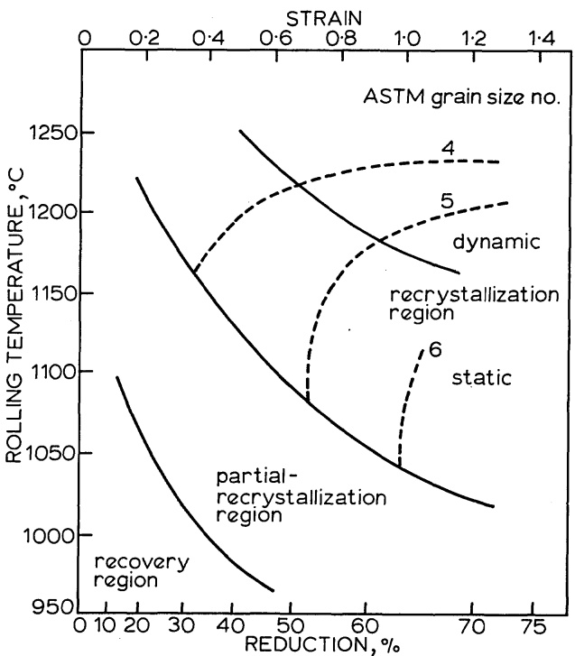

10 Austenite recrystallization and resulting grain size as function of rolling temperature and reduction for 0.03%Nb steel; steel was reheated to 1250°C for 20 min, rolled with one pass, and quenched; initial grain-size number was 1.0; after Ouchi et al.51

On the contrary, it is necessary to apply more deformation than that required for recrystallization. The critical amount of deformation, $R _ { \mathbf { c r i t } } ,$ required for the completion of recrystallization is small, as is the temperature dependence in plain C steel. In Nb steel, however, $R _ { \mathrm { c r i t } }$ is very large and its temperature dependence substantially higher.27 The effects of deformation temperature and initial grain size on $R _ { \mathrm { c r i t } }$ are shown in Fig. 9. In Nb steel, the effect of grain size on $R _ { \mathbf { c r i t } }$ is extremely large, and $R _ { \mathbf { c r i t } }$ increases rapidly with decreasing deformation temperature. Recrystallization is virtually suppressed below 950°C.

Ouchi et al.51 and Tanaka et al.28,29,52 studied the general recrystallization behaviour by single-pass rolling, shown in Fig.10. Recrystallization behaviour is divided into three regions, recovery, partial recrystallization, and recrystallization. The recrystallization region is subdivided into static and dynamic. The critical amount of deformation dividing each region increases rapidly with decreasing deformation temperature. It is also influenced markedly by the addition of microalloying elements, and in particular Nb.51,52 Reduction in the recrystallization region produces a fine, uniform recrystallized grain structure. Reduction in the partial-recrystal lization region produces a mixed structure consisting of recrystallized grains and recovered grains. Reduction in the recovery region produces locally very coarse grains due to strain-induced grain-boundary migration, while most grains remain unchanged, releasing stored energy by recovery,28,52 As is clear from Fig. 10, it is very difficult to roll steel in the recrystallization region and, in particular, during the initial passes in the plate mill, since $R _ { \mathbf { c r i t } }$ is extremely large. In practice, rolling passes are carried out in the recovery region or, at most, in the partialrecrystallization region. Tanaka et al. 28,52 described clearly how to achieve grain refinement and how to obtain a uniform grain structure under these conditions. Even if deformation is applied repeatedly in the recovery region, very sluggish and incomplete recrystallization occurs, while huge grains larger than the initial size are produced locally and persist throughout rolling, see Fig. 11, which leads to the formation of a mixed α-grain structure. However, if reduction is applied in the partial-recrystallization region, recrystallization increases in volume fraction with an increasing number of passes, reaching complete recrystallization, see Fig. 12. However, once huge grains are formed by a slight reduction in the recovery region, they persist even after many passes in the partial-recrystallization region. In summarizing the above description, if the initial rolling passes are made in the recovery region, huge grains are formed locally, owing to the straininduced grain-boundary migration, which persist throughout the whole course of rolling. They transform to upper bainite and/or coarse ferrite grains, giving poor toughness. On the other hand, if a reduction per pass greater than that for partial

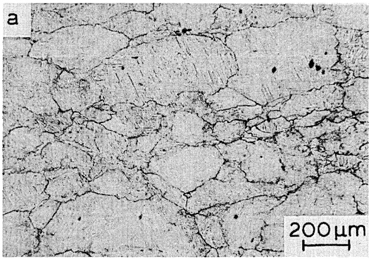

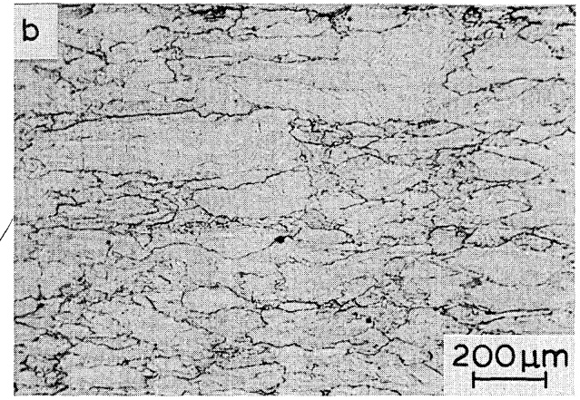

a 6% per pass, ×5 passes (in total 27%); b 6% per pass, ×9 passes (in total 43%)

recrystallization is given successively, a uniform and refined grain structure is obtained. Once complete recrystallization takes place, successive recrystallization proceeds much more easily.

It is considered that the strain-induced pre-cipitation of fine Nb(C, N) is the reason that the critical amount of reduction required for recrystallization and its temperature dependence is much larger for Nb steel than for plain C steel.51,53

## Formation of mixed grain structure

Controlled rolling produces a finer α-grain size than not only conventional hot rolling but normalizing. Unfortunately, controlled-rolled steel often exhibits a mixed structure consisting of fine and coarse α-grains and/or upper bainite, decreasing low-temperature toughness.

Mixed grain structure of α is attributed to that of γ. Under the circumstances where partial recrystallization occurs, fine recrystallized grains tend to form at γ-grain boundaries, leaving an unrecrystallized region in the grain interior where the mixed γ-grain structure is produced.22 When

11 Variation in austenite grain structure with number of passes in the recovery region in Nb steel

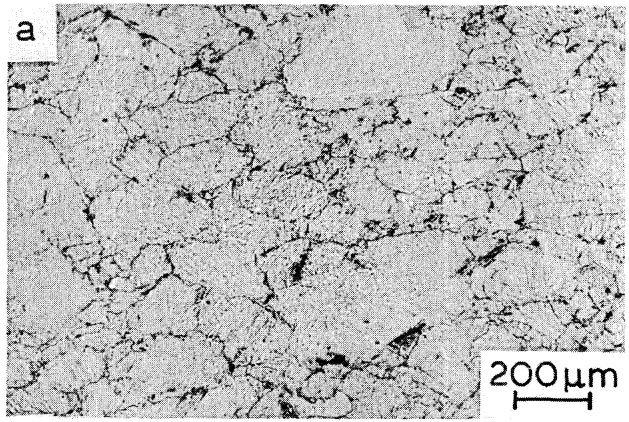

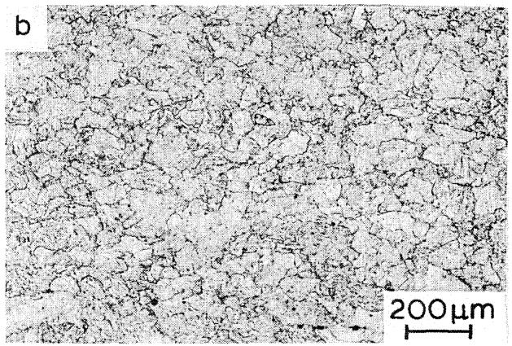

a 10% per pass, ×3 passes (in total 28%); b 10% per pass, ×5 passes (in total 42%)

12 Increase in fraction recrystallized with increasing number of passes when deformation was given in partial recrystallization region; after Tanaka28

γ-grains are coarse, or when rapid grain growth takes place after recrystallization owing to an unsuitable deformation condition, a mixed γ-grain structure tends to be induced.39 Once a mixed γ- grain structure occurs, it cannot be eliminated by later rolling passes.21 This is considered due to the fact that, when rolled again, the recrystallized region in the vicinity of grain boundaries in the previous pass tends to recrystallize preferentially, since it has a smaller grain size than the unrecrystallized region of the grain interior (see Fig. 9). To prevent the formation of a mixed grain structure, suitable conditions of holding21,39or a 'continuous'schedule22involving reduction in the whole temperature range have been proposed (see Fig. 1). The formation and prevention of a mixed grain structure at high temperatures have already been described in the previous section.

## DEFORMATION IN NON-RECRYSTALLIZATION REGION

## Retardation of recrystallization

In order to decrease grain size further, deformation in the non-recrystallization region must be

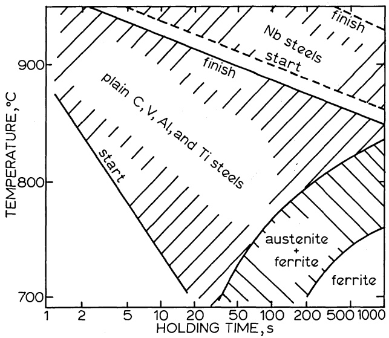

13 Recrystallization of austenite following single deformation of 50% in various steels; after Irvine et $a l . ^ { 2 4 }$

applied following deformation in the recrystallization region.

In plain C steel, recrystallization becomes sluggish at low temperatures in the γ-region (about $900^{\circ}C \approx A r_{3} \cdot^{24,54}$ Nb has a powerful influence in retarding γ-recrystallization, thereby áchieving a non-recrystallized state, see Figs.13 and 14. They show a marked temperature dependence of the progress of recrystallization, and also a large recrystallization-retarding effect of Nb. Kozasu et $a \vec { l } . ^ { 2 5 }$ reported that, besides a very large retarding effect of Nb, V had some retarding effect, while Al and Al+N accelerated recrystallization slightly. Although both V and Nb are strong carbide-forming elements the former does not have any retarding effect, while the latter exhibits a very strong retarding effect. This is considered due to differences in solubility in $\gamma ,$ and strain-

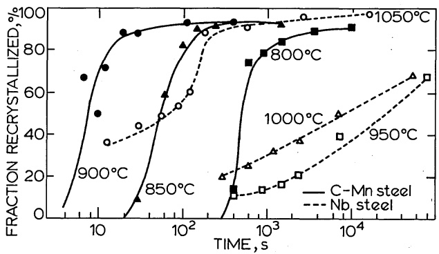

14 Fraction recrystallized in austenite as function of holding time in plain C and Nb steels; steels were reheated to $\mathbf { 1 2 5 0 ^ { \circ } C } ;$ hot rolled to 30%, and held at rolling temperature; after Ohmori55

induced precipitation potential between the two elements. The retardation of recrystallization due to Nb can be exhibited only when Nb is in solution in $\gamma$ before deformation. If Nb remains undissolved because of a low heating temperature, it does not demonstrate any delaying effect.22,24,32,56-58

The recrystallization retardation due to Nb has been discussed by many investigators.21,22,24, $27,30-32,51,54-72$ It has been attributed to (i) a solute-drag effect,30,31,56,67,71 (ii) straininduced precipitation of fine Nb(C, N),21,22,32,59, $62,64,66,68-70,72$ or (iii) the combined effects of solute Nb and precipitation of fine Nb(C, N).31,56, 67,71 Coladas et $a \tilde { l _ { \bullet } } ^ { 6 7 }$ reported that the main influence of Nb alloying is on the incubation time for the start of recrystallization, and not on the kinetics of recrystallization after incubation and, further, that the delayed recrystallization is due to a solute effect, see Fig. 15.

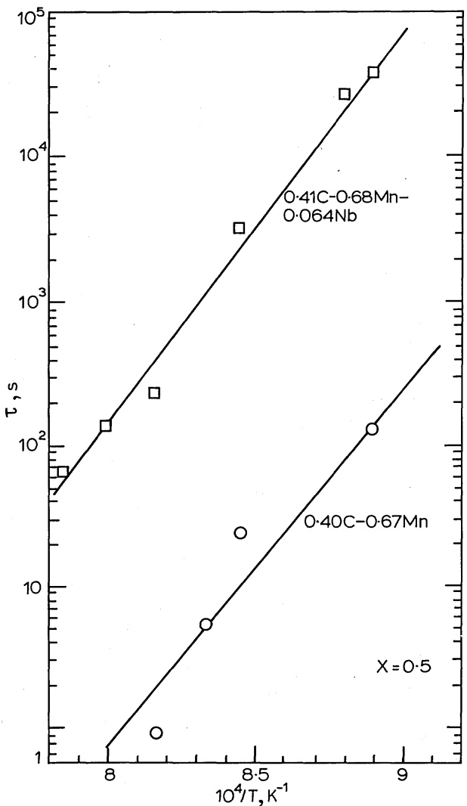

15 Dependence of time constant in Avrami's law on temperature; $X = 1 - \exp [ - ( t / \tau ) ^ { \mathrm { n } } ]$ , where X is fraction recrystallized, t is time, τ is time constant, and n is constant; after Coiadas et $\pmb { a l . 6 7 }$

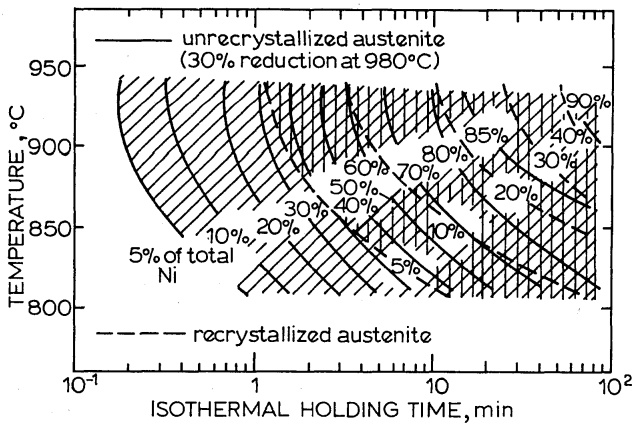

16 Time—temperature-precipitation diagram showing effect of deformation of Nb(C, N) in austenite in Nb steel which was reheated to $\mathbf { 1 2 6 0 ^ { \circ } C } ,$ grain refined, and deformed to 30%; after Watanabe et al.68

The retarding effect due to the strain-induced precipitation of fine Nb(C, N) has been proposed by many investigators using several different approaches.22,49,55,59,67,69 Ohmori55 suggested a retarding effect due to fine precipitation, based on the fact that the relation between time for recrystallization and the recriprocal of temperature does not obey a linear relation, which is well explained in terms of the concurrent precipitation of Nb(C, N). Jones and Rothwel $1 ^ { 2 2 }$ and others32,69 observed the precipitation of $\mathrm { N b ( C , N ) }$ on the deformation substructure of $\gamma ,$ which retarded subsequent recrystallization. By holding isothermally after hot deformation, Watanabe et al.68 observed the progress of the precipitation of $\mathrm{Nb}(\mathbf{C}, \mathbf{N})$ , which was determined by the electrolytic-extraction technique, see Fig.16. The start of precipitation is accelerated markedly by deformation, suggesting interaction between the precipitates and retardation of recrystallization.

Jonas and Weiss31 reported that the addition of Nb to γ retards recrystallization in two distinct ways; that there is a significant delay introduced by a solute effect, and that under conditions where precipitation is more rapid than solute-retarded recrystallization, operation of the recrystallization process is prevented or retarded until precipitation is complete or nearly complete. Combining their result with that of le Bon et $a l . ,$ 64 Jonas and Weiss31 constructed a recrystallization precipitation—time (RPT) diagram, shown in Fig. 17. When the time for the start of precipitation $P _ { \mathbf { s } }$ is longer than the recrystallization start time $R _ { \mathbf { S } ^ { \prime } } ^ { \mathbf { \tilde { \alpha } } }$ the RPT curve has the normal dependence on temperature affected by a solute drag. When $P _ { \mathbf { S } }$ is less than $R _ { \mathbf { g } } ,$ the nucleation and growth of recrystallization is severely impeded.

## Formation of deformation band

Figure 18 shows an elongated γ-grain structure produced by deformation in the γ-region (Fig. 18a)

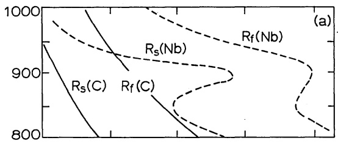

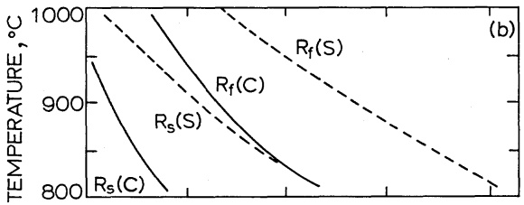

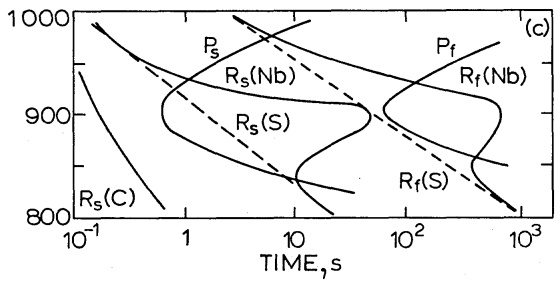

17 a comparison of recrystallization kinetics of plain Č and Nb-modified steel reported by le Bon et $a l . ^ { 6 4 } ; b$ derived effect of Nb as solute (S) on recrystallization kinetics of Nb-modified steel of a; c superimposition of precipitation—temperature—time diagram for dynamic precipitation and derived recrystallization—temperature—time diagram of b for rate of solute-modified recrystallization; $R _ { \mathbf { S } }$ and $R _ { \mathbf { f } } ,$ , and $P _ { \mathbf { S } }$ and $P _ { \mathbf { f } }$ represent start and finish for recrystallization and precipitation, respectively; after Jonas and Weiss31

and partially transformed grain structure (Fig. 18b). α-grains are nucleated in deformation bands as well as γ-grain boundaries, individual grains being formed frequently within γ-grains. Although the nature of deformation bands is not known exactly, they generally exist in closely packed pairs of parallel lines which often terminate within a grain, creating a twin-like pattern in heterogeneous distribution.34 The studies on deformation bands are not numerous.34,41,49,73,74 As shown in Fig.19, deformation-band density increases a little in the strain range of less than $\mathbf { 3 0 } \% ,$ beyond which it increases rapidly with increasing reduction. The deformation-band density is barely affected by deformation temperature in the non-recrystallization region, but it decreases rapidly when the temperature exceeds \~1000°C,34 while according to Sekine and Maruyama41 the apparent γ-grain-boundary area (γ-grain boundary plus deformation bands) increases with an increasing amount of reduction, reaching a steady level above ${ \sim } \mathbf { 3 0 } \%$ reduction. It is worth noting that, with an increasing amount of reduction, the γ-grain-boundary area increases gradually, while deformation-band

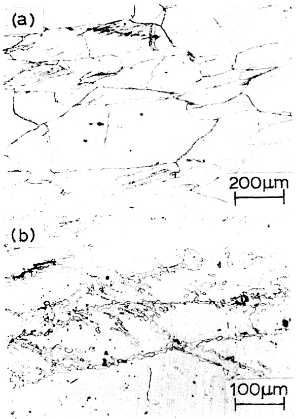

18 a elongated austenite grains with deformation bands produced by deformation in non-recrystallization region and b pro-eutectoid ferrite formation in partially transformed grain structure; after Tanaka43

density increases rapidly, indicating that α-grain refinement resulting from deformation in the non-recrystallization region is due mainly to an increase in the deformation band. The grainboundary area is increased only by a factor of about 2 when total deformation in the non-recrystallization region is 70—80%.75It is also important to note that even when the deformation band is saturated in number, about 10% of γ-grains contain very few deformation bands,41and that not all deformation bands have the same ferritenucleation potential³4; some bands only have very thin, straight bands of α, implying poor nucleation capacity. Even the introduction of deformation bands cannot bring about uniform and homogeneous γ-grain structure and thereby homogeneous α- grain structure. Inhomogeneity in grain structure is the fate of as-hot-rolled material which can, however, be reduced with a decrease in recrystallized γ-grain size before deformation in the non-recrystallization region.

The α-grain size correlates with effective γ interfacial area $S _ { \mathbf { v } }$ (grain-boundary area plus deformation bands), shown in Fig. 20. Although an increase in $S _ { \mathbf { V } }$ causes α-grain refinement, for a fixed $S _ { \mathbf { v } }$ value deformation in the non-recrystallization region refines α more effectively than

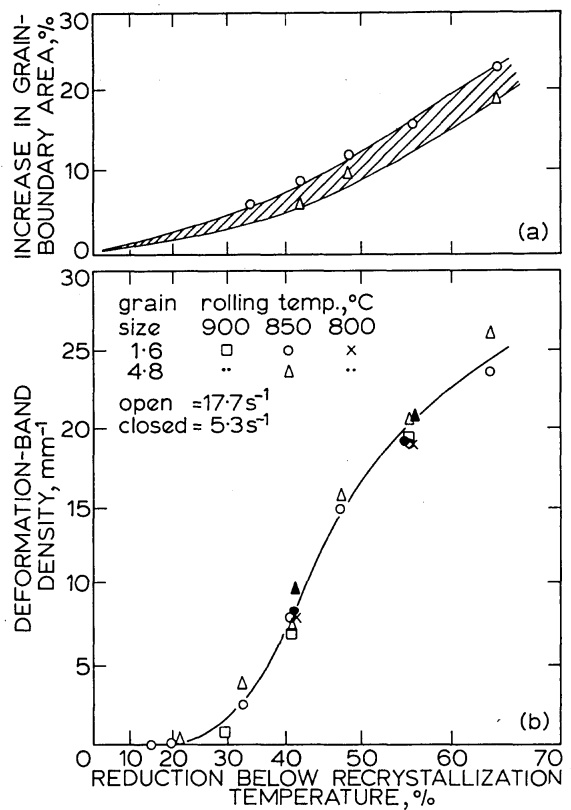

19 Variation in austenite grain-boundary area and introduction of deformation bands resulting from reduction in non-recrystallization region; in this 0. 03%Nb steel, initial grain size was varied by rolling in two passes at higher temperatures after reheating to 1250°C; after Kozasu et al.34

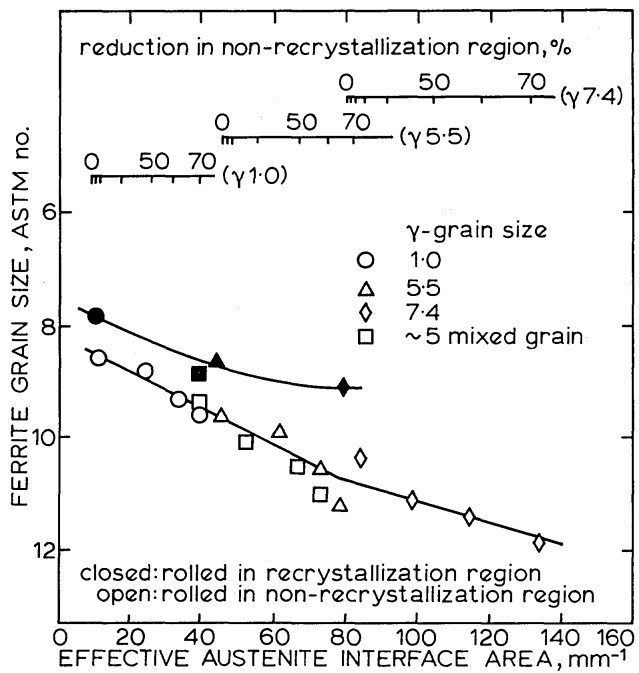

20 Variation in ferrite grain size with effective austenite interface area in Nb steel; after Kozasu et al.34

that in the recrystallization region. According to Ouchi et $a l . , ^ { 5 1 } \mathrm { i n }$ the early stage of transformation the transformation rate is given by $N _ { \bf S } \times S _ { \bf V } ,$ , where $N _ { \mathbf { S } }$ is the nucleation rate per unit boundary area. While γ-grain refinement through recrystallization increases only the $S _ { \mathbf { v } }$ value, deformation in the non-recrystallization region increases both $N _ { \mathbf { s } }$ and $s _ { \mathrm { v } } .$ The unrecrystallized γ-structure contains a high dislocation density and substructure besides elongated grain boundaries and deformation bands which surely enhance the nucleation rate $N _ { \mathbf { S } } .$ In a sense, general diffusional transformation controlled by the interface nucleation growth mechanism is accelerated by the deformation in the non-recrystallization region.51

The ratio of γ-grain size to α-grain size accompanying transformation reduces with decreasing γ-grain size, reaching a limiting value of \~1 in both hot-rolled and normalized steels.41 However, when rolled heavily in the non-recrystallization region, the ratio is 2.3—2.5, where the α- grain size is determined by the linear intercept method in the through-thickness direction,41 showing the superior effect on grain refinement of deformation in the non-recrystallization region. In practice, when finely recrystallized γ is given 70— 80% reduction in the non-recrystallization region, the ASTM grain-size no.is \~12, whereas normalization produces, at most, grain size no.\~10.

## DEFORMATION IN AUSTENITE—FERRITE REGION

## Change in microstructure and mechanical properties

A limiting γ-grain size achieved by deformation in the recrystallization region is broken by deformation in the non-recrystallization region. Grain refinement due to deformation in the non-recrystallization region reaches a limiting value at 60—70% reduction. This limit can be broken only by deformation in the γ—α two-phase region. Besides grain refinement, deformation in the two-phase region gives a substantially different effect on microstructure and mechanical properties. Microstructural change accompanying deformation in the two-phase region has already been shown schematically in Fig.4. Figure 21 shows the changes in intensity of the (200) reflection, strengths, and toughness with deformation in the two-phase region. With an increasing amount of defórmation, the yield and tensile strengths increase, while the transition temperature and absorbed energy decrease. Microstructural change accompanying deformation in the two-phase region is shown in Fig. 22.27 Deformation in the γ-region alone produces a microstructure consisting of equiaxed α-grains with low dislocation density (see Fig. 22a and b). Deformation in the two-phase region produces a mixed grain structure, which consists of equiaxed α-grains and 'cold-worked'

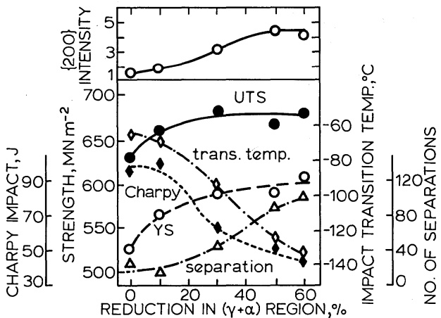

21 Intensity of (200) reflection, tensile properties, and Charpy impact properties plotted against amount of reduction in austenite— ferrite region in Nb steel; after Tanaka et al,27

grains in terms of an optical microscopic scale, or consists of polygonal grains and subgrains in terms of an electron microscopic scale (see Fig. 22c and d). The deformed γ transforms to polygonal α, while the deformed α changes into subgrains. In deformed α, recrystallization is very sluggish, producing subgrains. This is because of the stabilization of the α sub-boundary network due to strain-induced precipitation of Nb(C, N) and/or V(C, N).22,30,32,69,76 It is postulated that, during rolling, the γ to α transformation can nucleate on the unrecovered dislocation substructure.77 Thus,formed α-grains soon impinge on existing γ-subgrains and cannot grow further. This kind of mutual interaction between deformed γ and α produces a further decrease in α-grain size.

Deformation in the two-phase region produces a duplex structure consisting of soft polygonal grains and hard subgrains. On the other hand, deformation of γ produces a single structure consisting of soft grains alone. This difference in microstructure between the two controlled-rolling conditions brings about a difference in mechanical properties between the two materials.

It has already been stated that deformed α does not recrystallize, but only recovers because of strain-induced precipitation of Nb(C, N) in the α substructure, which leads to a fine α-grain structure. The sizable influence on grain refinement of deformation in the two-phase region was observed in Nb-free steel too.78-80 Priestner and de los $\mathbf { R i o s ^ { 7 7 } }$ reported that when transformation began during rolling, the much greater refinement of the α-grain size resulted from extra intragranular formation of α-grains, indicating that it was the substructure, and not microalloyed pre-cipitates, that caused the extra nucleation of α. Melloy and Dennison78 and other investigators79,80

a, b 0%; c, d 30%

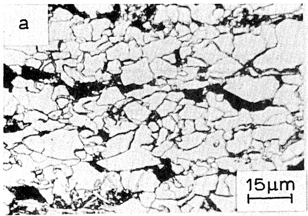

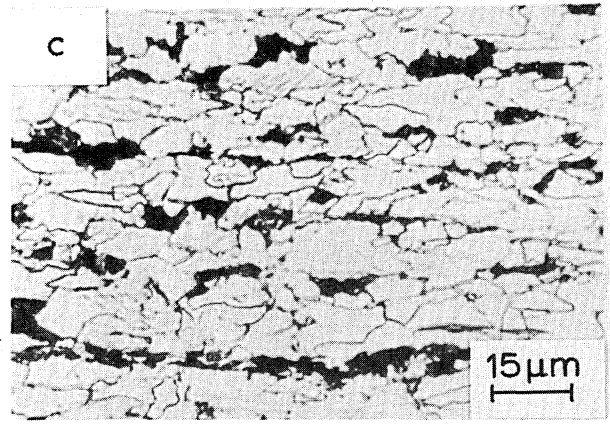

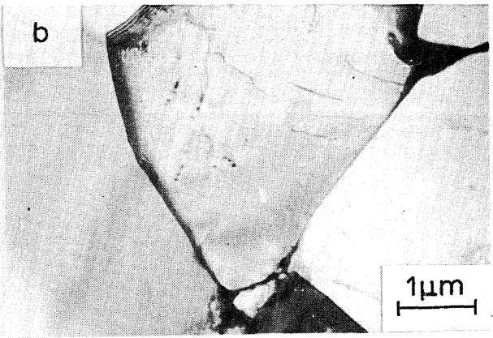

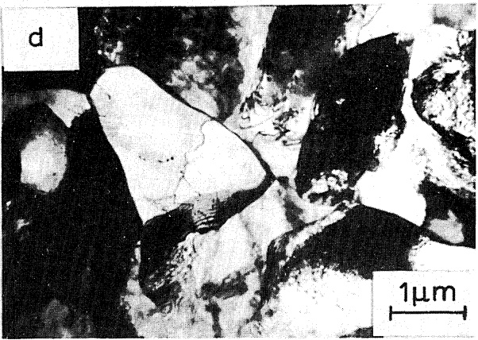

22 Change in microstructure with amount of reduction in austenite—ferrite region in Nb steel; after Tanaka et al.27

attributed grain refinement to the dynamic recovery and/or dynamic recrystallization of α in Nb-free steel.

## $A r _ { 3 }$ temperature during controlled rolling

Depending on its purpose, controlled rolling is performed either in the γ-region alone or in the two-phase region. Therefore,to perform controlled rolling adequately, the $A r _ { 3 }$ temperature during the controlled-rolling process must be known precisely. In controlled-rolled steel, strain energy stored during deformation in the non-recrystallization region accelerates the $\gamma$ to α transformation, i.e. a strain-induced transformation takes place, thereby raising the ${ A r } _ { 3 }$ temperature. The measurement of strain-induced $A r _ { 3 }$ temperature has been performed by a variety of techniques, thermal analysis,34,81dilatometric methods with compression device,82,83 and microstructural change.44 However, these measurements were not always carried out with precision or under the conditions where real controlled rolling was simulated, because of the limitations imposed by instruments and/or the difficulty in simulating controlled rolling. Tanaka and Tabata35 reported that the strain-induced ${ A r } _ { 3 }$ temperature could be determined correctly by measuring texture intensity, which can be applied to any controlled-rolling condition. Their result is shown in

Fig. 23, where the $A r _ { 3 }$ temperature increases with increasing amount of reduction in the non-recrystallization region, which is more noticeable in the larger prior austenite grain size.

## PROPERTIES OF CONTROLLED-ROLLED STEELS

## Anisotropy due to development of texture

When compared in terms of the same carbon equivalent, controlled-rolled steel has greater strength than the conventionally hot-rolled type, and it exhibits a lower transition temperature than normalized, or quenched and tempered steel. However, controlled-rolled steel has its own disadvantages. The most serious one is the anisotropy in mechanical properties due to texture development.

In controlled-rolled steel a crystallographic texture develops,27,35,37,54,76,84-92 the magnitude of which depends on whether deformation is carried out in the non-recrystallization region or in the two-phase region, or whether the microstructure consists of α or bainite. Yutori and Ogawa91 reported that even when deformation in the non-recrystallization region is given under the same rolling conditions, the intensity in texture is different depending on transformed microstructure, see Fig. 24. All three structures exhibit a similar texture, consisting of 〈110>RD (rolling direction) orientations with the strongest component of {113}(110〉 and {332}(113). However, there is a remarkable difference in intensity between polygonal ferrite-pearlite and acicular ferrite or martensite. When steel has a low Mn and/or Ni- content, producing an α-structure, it shows a weak texture intensity. However, with an increasing Mn and/or Ni content the microstructure becomes bainitic, developing a texture with {332}113) and {311}011〉orientations.87,90

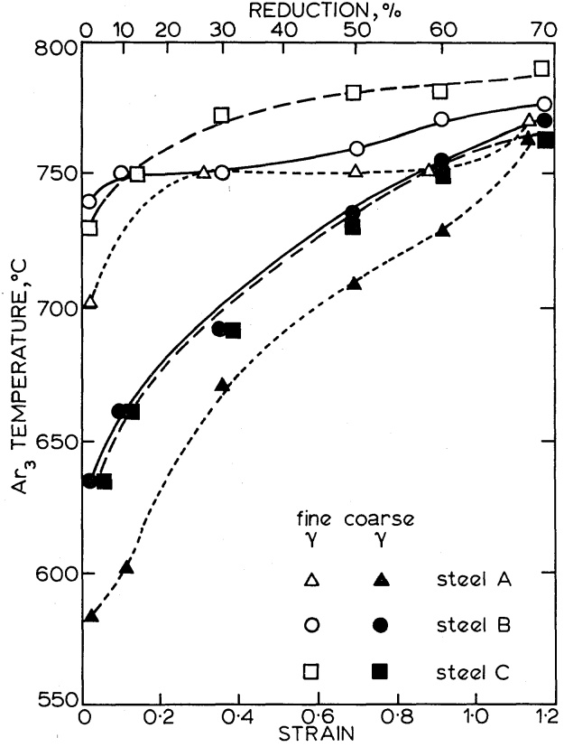

23 Effects of amount of deformation in non-recrystallization region and initial grain size on austenite-to-ferrite $A r _ { \mathbf { { 3 } } }$ temperature measured by texture development in Nb steel; after Tanaka and Tabata³5

As shown in Fig. 22, α -phase deformed, in the two-phase region remains mainly in the recovered condition in Nb steel. This means that the texture developed by deformation in the two-phase region is the 'cold-rolled' texture. One example of texture developed by deformation in the two-phase region is shown in Fig. 25. Exhibiting ferrite— pearlite structures, the three have basically the same texture, the intensity being raised with an increasing reduction in the two-phase region. A weak texture with {112}110〉 and {554}(225〉 components develops by heavy deformation in the γ- region alone. Deformation in the two-phase region produced textures consisting of (i) (110>RD partial fibre texture, (ii) 〈100>ND texture (ND is normal direction, where the (100〉 axis is perpendicular to the plate surface), (iii) 〈111〉|ND, and (iv) 〈110>∥TD (transverse direction) texture with a strong {554} (225〉 component. Among those four textures, (iii) and (iv) do not have a detrimental effect on mechanical properties, but (i) causes plane anisotropy and (ii) causes embrittlement in the through-thickness direction. The plane anisotropy in mechanical properties caused by the 〈110>RD texture was examined theoretically and experimentally by Inagaki et $a l . , 9 2$ shown in Figs. 26 and 27, where toughness is represented in terms of normal stress acting on the cleavage surface, i.e. the {100} plane. The diagonal (45°) direction has low strength but a high susceptibility to cleavage fracture (high transition temperature). The longitudinal (0°) and transverse (90°) directions exhibit high strength and low susceptibility to cleavage fracture (low transition temperature). Figure 28 shows plane anisotropy developed in steels finish rolled in the non-recrystallization region or in the two-phase

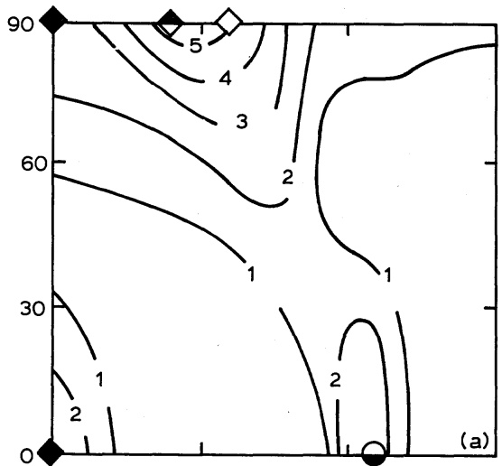

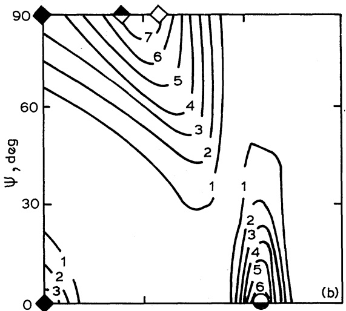

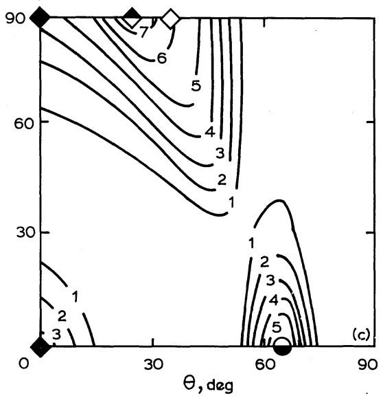

a polygonal ferrite—pearlite; b acicular ferrite; c martensite

24 Sections at $\phi = 4 5 ^ { \circ }$ of crystallite orientation distributions, showing transformation textures of controlled-rolled steels with various structures,◆ : {001}110>,: {113}(110>,: {112}(110),: {332}(113); after Yutori and $\mathbf { \dot { O g a w a ^ { 9 1 } } }$

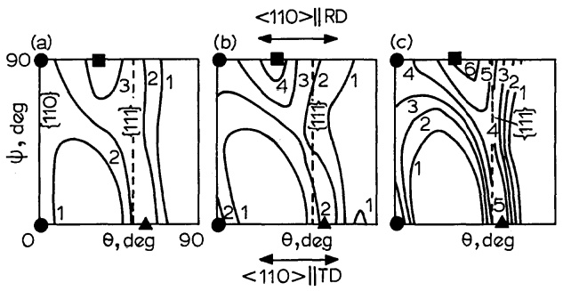

25 $\phi = 4 5 ^ { \circ }$ of crystallite orientation distribution function for steel deformed in non-recrystallization region and subsequently in austenite ferrite region; deformation in austenite ferrite region was a 0%, b 10%, c 60%, ●: {100}(100},: {112}(110), ▲: {554}(225); after Tanaka and Tabata35

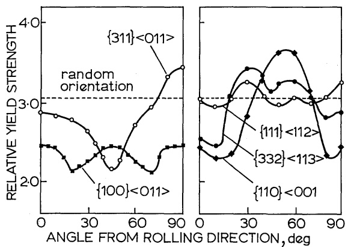

26 Anisotropies of relative yield strength calculated for 〈110〉 ∥ RD ideal orientation; Inagaki et al.92

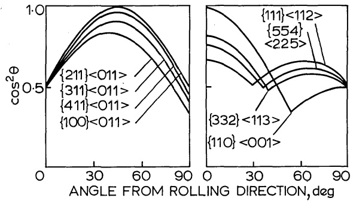

27 Anisotropies of orientation factor for brittle fracture, cos2θ, calculated for various ideal orientations; θ is angle between test direction and normal to plane; after Inagaki et al.92

region. The former develops a weak texture, showing indistinct anisotropy, while the latter develops strong plane anisotropy due to an intensive texture, which is very similar to Figs.26 and 27.

## Separation

In controlled-rolled steel, a matter more serious than plane anisotropy is embrittlement in the through-thickness direction, resulting mainly from the formation of a {100} texture. Figure 29 shows schematically the full Charpy curves and number of separations in the L(longitudinal) and Z(through-thickness) directions, where curves of the T(transverse) direction are located near those of the L direction. The difference in transition temperature between the L and Z directions is more than 100 K. The low transition temperature in the L direction is due to separations95 (very

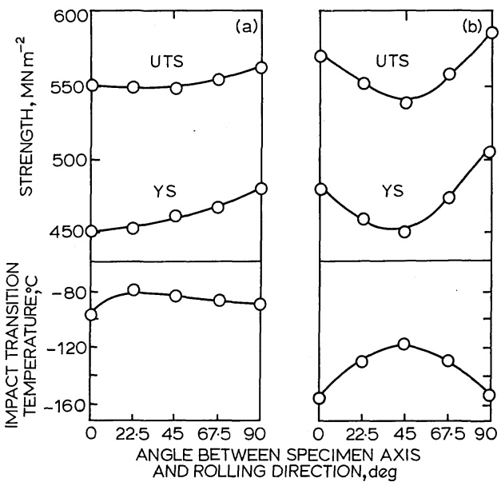

28 Anisotropies of strength and transition temperature; finish rolled in ¿ non-recrystallization region and b austenite—ferrite region; after Tanaka93

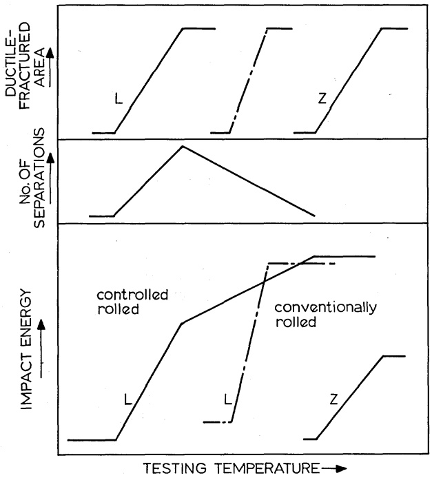

29 Schematic representation of full Charpy curves in longitudinal L and through-thickness Z directions of controlled-rolled steel; after Kozasu94

often called delamination or splitting) which occur in a brittle manner37 in a fractured Charpy specimen parallel to the plate surface. As shown in Fig.30, separation is greatest near the temperature where the ductile-fracture area becomes just 100%, being nil in the brittle range or at high temperatures $\mathbf { \alpha } _ { 2 } \mathbf { \alpha } _ { 7 } , \mathbf { \alpha } _ { 9 } \mathbf { \alpha } _ { 6 } , \mathbf { \alpha } _ { 9 } \mathbf { \alpha } _ { 7 }$ In contrast to conventionally hot-rolled steel, the Charpy impact energy of controlled-rolled steel increases with increasing temperature éven in the ductile-fraction region, while the number of separations decreases. Impact energy reaches the shelf energy and separation disappears when the temperature reaches the transition temperature in the Z direction.

The occurrence of separations, accompanied by a lowering of the transition temperature, has been explained in terms of the critical stress criterion.98,99 When the Charpy specimen is given a bending force the maximum stresses are induced at the plastic/elastic interface, just beneath a notch under the plane-strain condition.98,100 Induced stress is greatest in the L direction, followed by the Z and T directions,100 when a longitudinal specimen is considered. The condition for the occurrence of separation is given by

$$
\sigma _ { \mathrm { ~ f ~ } } ^ { \mathrm { L } } > \sigma _ { \mathrm { L } } \quad \cdot \quad \cdot \quad \cdot \quad \cdot \quad \cdot \quad \cdot \quad \cdot \quad \cdot\tag{5}
$$

$$
\sigma _ { \mathbf { f } } ^ { \mathtt { Z } } = \sigma _ { \mathtt { Z } } \qquad . \qquad . \qquad . \qquad . \qquad . \qquad . \qquad .\tag{6}
$$

where $\sigma _ { f } ^ { \mathrm { L } }$ and $\sigma _ { f } ^ { \mathrm { Z } }$ are the cleavage fracture strengths in the L and Z directions, and $\sigma _ { L }$ and $\sigma _ { z }$ are the stresses acting in the L and $Z$ directions, respectively. By subtracting (6) from (5), we obtain

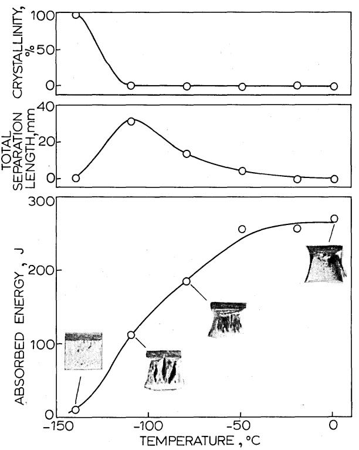

30 Occurrence of separations in Nb steel deformed in austenite—ferrite region

$$
\begin{array} { r } { \sigma _ { \mathrm { f } } ^ { \mathrm { L } } - \sigma _ { \mathrm { f } } ^ { \mathrm { Z } } \geqslant \sigma _ { \mathrm { L } } - \sigma _ { \mathrm { Z } } = k ^ { \prime } \sigma _ { \mathrm { y } } \qquad \mathrm { ~ . ~ } \qquad \mathrm { ~ . ~ } \qquad . } \end{array}\tag{7}
$$

where $\sigma _ { \mathbf { y } }$ is the uniaxial yield stress and $k ^ { \prime }$ is a constant. As is clear from equation (7), separation occurs only when there is anisotropy in the fracture strength, i.e. only when fracture strength is lower for the Z direction than for the L direction. As the occurrence of separation changes the stress state from plane strain to plane stress, it becomes more difficult for brittle fracture to occur. Embury et al.101 and Miyoshi et al.96 reported that separated material behaves in a similar manner to that of laminated plate.

The cause of through-thickness embrittlement has been studied by many investigators,89,96-99, 102-110 and the following suggested: (i) a crack initiates at an MnS inclusion flattened by lowtemperature finish rolling, and propagates along grains with {100} orientation and/or a banded structure102,107,109; (ii) the clusters of crystal grains with {100} orientation are the main sources of separation cracks,96,97,105 since separation occurs even in steel with an extremely low S content,103 and this is strongly supported by the observation that separation increased with increasing intensity in the {100} texture27; (iii) intergranular failure along prior γ-boundaries, probably embrittled by the segregation of impurities, increases the occurrence of separations99; (iv) in hot-rolled strip, temper embrittlement caused by the segregation of P to α-grain boundaries in the rich layer during slow cooling after coiling deteriorates boundary toughness108; (v) dimensional anisotropy of the microstructure produced by controlled rolling - γ-grain in the case of the intergranular fracture, and α-grain in the case of transgranular — is the main cause of through-thickness embrittlement99,104; (vi) pearlite and/or a bainite banded structurel10; and (vii) a combination of these effects.104,105

The mechanism initiating separation may depend on chemical composition, microstructure, and hot-rolling condition. When stress is induced in the through-thickness direction, cracks initiate at the place where the fracture strength is lowest, and propagate along the second weakest location. When flattened MnS exists in steel, it triggers the initiation of the crack, which propagates along grains with {100} orientation and/or bainite and/or the pearlite band, depending on the situation. If MnS exists very occasionally in steel with an extremely low S content, separation will initiate at the second weakest location.

Separation has a large effect on transition temperature and absorbed energy. The latter is influenced most markedly near the temperature where shear area becomes just 100%, exhibiting the greatest number of separations.94,96As shown in Fig.31, both absorbed energy and transition temperature decrease with an increasing number of separations. As is clear from the above explanation, the low-temperature toughness in the L and T directions is improved by the sacrifice of that in the Z direction.

## Elimination of separation

Various methods have been proposed to prevent the occurrence of separations.27,110-112 In order to eliminate flattened MnS which triggers the initiation of separation, inclusion-shape control has been employed, which converts elongated sulphide to a globular inclusion by the addition of rare earth metals111,113 and/or Ca.112,114 Advancing the sulphide-shape control·technique, a new desulphurization method has been developed, which can reduce the S content to an extremely low level. Finish rolling in the γ-region results in the formation of a weak {100} texture, suppressing markedly the occurrence of separation. A decrease in the P content is desirable, since it causes temper embrittlement during slow cooling after coiling in hot-rolled strip.108 Once initiated separation has a propensity to propagate along the banded structure.110 Mori et al.110 reported that the occurrence of separation is determined by the combined effect of band density and {100} intensity, and that the addition of Cr disperses a banded structure, thereby suppressing the occurrence of separations.

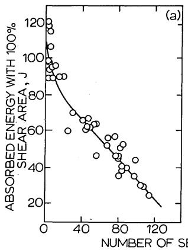

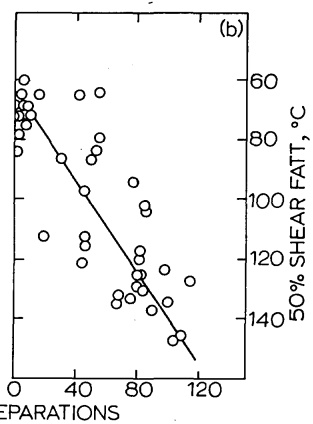

31 Influence of number of separation on absorbed energy with a 100% shear area and b transition temperature in controlled-rolled steels; after Tanaka et al.27

## STRENGTHENING AND TOUGHENING MECHANISMS

## Equations describing strength and toughness

The strengthening mechanism in controlled-rolled steels will be described briefly. The yield stress of polycrystalline solids follows the Hall—Petch relation8:

$$
\begin{array} { r l } & { \boldsymbol { \sigma } _ { \mathbf { y } } = \boldsymbol { \sigma } _ { \mathbf { 0 } } + k _ { \mathbf { y } } d ^ { - 1 / 2 } } \\ & { \quad = ( \boldsymbol { \sigma } _ { \mathbf { l h } } + \boldsymbol { \sigma } _ { \mathbf { s h } } + \boldsymbol { \sigma } _ { \mathbf { d h } } + \boldsymbol { \sigma } _ { \mathbf { p h } } ) + k _ { \mathbf { y } } d ^ { - 1 / 2 }   . } \end{array}\tag{8}
$$

where $\sigma _ { \mathbf { o } }$ is internal stress, d is grain size, and $k _ { \mathbf { y } }$ is a constant; $\sigma _ { \mathbf { o } }$ is divided into several terms: lattice hardening, solid-solution hardening, dislocation hardening, and precipitation hardening. Observing extra hardening due to texture development, Little et $a l . ^ { 3 6 }$ and Coleman et $a l . ^ { 3 7 }$ proposed to add texture hardening $\sigma _ { \mathrm { t e x t } }$ to equation (8) which was, however, found to be quite small.27 Baker and McPherson115 observed strengthening due mainly to subgrain hardening in microstructure mixed with subgrains:

$$
\begin{array} { r l } { \sigma _ { \mathbf { y } } = \sigma _ { \mathbf { 0 } } + k _ { \mathbf { y } } d ^ { - 1 / 2 } + \sigma _ { \mathrm { t e x t } } + \sigma _ { \mathrm { s u b } } \mathrm { ~ . ~ } } & { { } \mathrm { ~ . ~ } } \end{array}\tag{9}
$$

Matsuda et al.116 reported that in the martensitic structure the prior γ-grain was divided into several blocks, which play the same role with large-angle grains, becoming obstacles to the propagation of yield and cleavage cracks. The concept of this 'effective grain size'was evidenced by other investigators.117,118 Equation (8) is rewritten as

$$
\boldsymbol { \sigma } _ { \mathbf { y } } = \boldsymbol { \sigma } _ { \mathbf { 0 } } + k d _ { \mathbf { e } } ^ { - 1 / 2 } \quad \mathrm { ~ . ~ } \quad \mathrm { ~ . ~ } \quad \mathrm { ~ . ~ } \quad \mathrm { ~ . ~ } \quad \mathrm { ~ . ~ }\tag{10}
$$

where $d _ { e }$ is the effective grain size. Deformation in the two-phase region produces a mixed grain structure consisting of polygonal grains and subgrains or cellular substructures. Bramfitt and Marder88 proposed that the cell contribution to yield strength could be added by allowing for respective volume fractions of grains and cells in a partially recrystallized structure as follows:

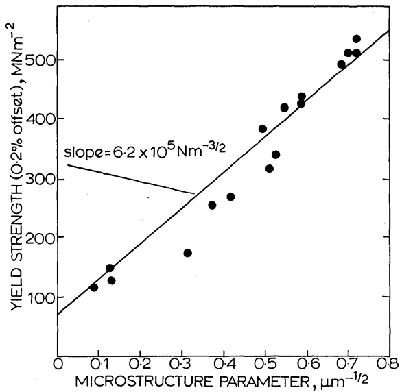

32 Yield strength v. microstructure parameter, which takes into account contributions from both equiaxed.grain size and subgrain or cell size; after Bramfitt and Marder88

$$
\begin{aligned}\sigma_{\mathrm{y}} &= \sigma_{0} + k_{\mathrm{y}} d^{-1/2} \left(1 - f_{\mathrm{c}}\right) \\& \quad + k_{\mathrm{c}} d_{\mathrm{c}}^{-1/2} f_{\mathrm{c}} \quad \cdot \quad \cdot \quad \cdot \quad \cdot\end{aligned}\tag{11}
$$

where $f _ { \mathbf { c } }$ is the fraction of cell structure, and $h _ { \mathbf { v } }$ and $k _ { \mathbf { c } }$ are the experimentally determined valués for plots of fully recrystallized structures and fully cellular structures, respectively. This model gave an approximate fit to the experimental data, see Fig.32.

From a theoretical point of view, Heslop and Petch9 showed that the ductile-to-brittle transition temperature is inversely proportional to $d ^ { - 1 / 2 }$ where d is the grain size. Based on the observation that, in a martensitic structure, the facet unit was the effective grain size, Kunitake et $a l . ^ { 1 1 7 }$ gave the transition temperature as

$$
T _ { \mathrm { \tiny ~ T S } } = A - B \log d _ { \mathrm { \tiny ~ e ~ } } ^ { - 1 / 2 } \quad \mathrm { ~ . ~ . ~ . ~ . ~ . ~ . ~ . ~ }\tag{12}
$$

where A and B are constants. Gladman et al.119 gave the transition temperature of bainitic steel by the equation:

$$
\begin{aligned}T_{\mathrm{TS}}(^{\circ}\mathrm{C}) = & -19 + 44(\%\mathrm{Si}) + 700(\%\mathrm{N}_{\mathrm{free}})^{1/2} \\& + 0.26(\sigma_{\mathrm{D}} + \Delta P + \Delta) - 11.5d^{-1/2}\end{aligned}\tag{13}
$$

where $\mathbf { \sigma _ { D } }$ is Ashby—Orowan strengthening from dispersed second-phase particles, and $\Delta P$ and ∆ are the assumed strengthening contribution from random or forest dislocations and the contribution from dislocations in low-angle boundaries, respectively. As is clear from equation (13), all of the

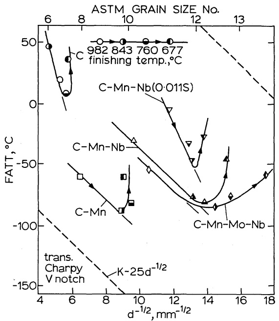

33 Effect of finishing temperature on transition temperature and grain size; the former increases rapidly when deformation temperature is lowered to austenite-ferrite region; after Speich and Dabkowski89

strengthening factors raise the transition temperature. The only exception is grain refinement, which increases yield strength and at the same time reduces transition temperature.

The sub-boundary cannot be an obstacle to the propagation of brittle cracking. However, if subgrains form a cluster, thereby developing a highangle boundary, this can arrest brittle cracking. As shown in Fig. 31, the transition temperature decreases in a linear manner with the number of separations. Taking these effects into consideration, Tanaka43 proposed the following equation:

$$
\begin{array} { r l } { T _ { \mathrm { r S } } = \Delta T + A ( \sigma _ { \mathrm { p h } } + \sigma _ { \mathrm { d h } } + \Delta ) } & { { } } \\ { - B d ^ { - 1 / 2 } ( 1 - f _ { \mathrm { S } } ) - C d _ { \mathrm { e } } ^ { - 1 / 2 } f _ { \mathrm { S } } - E n _ { \mathrm { S } } } & { { } } \end{array}\tag{14}
$$

where $\Delta \mathbf { T }$ is a constant depending on chemical composition; $A , B , C ,$ and $\vec { E }$ are constants; $, f _ { \mathbf { S } }$ is the volume fraction of subgrains; $d _ { e }$ is the effective grain size, where $d _ { e }$ is in between the equiaxed grain and subgrain sizes; and $n _ { \mathbf { S } }$ is the number of separations.

## Interpretation of mechanical properties

The reports on variation in transition temperature with deformation temperature in the two-phase region have been in disagreement with each other. As shown in Fig. 33, the transition temperature increased with a decrease in finishing temperature in the two-phase region; it reached a minimum at a certain temperature in the two-phase region, and increased again with a further decrease in finishing temperature.20,44,78 The transition temperature decreased with decreasing deformation temperature78: excessive reduction in the twophase region raised the transition temperature $_ { 1 } 2 7 ;$ and heavy reduction in the two-phase region lowered the transition temperature of plain carbon steel.79,80 Those contradictory reports are explained consistently by equation (14). In steel deformed in the two-phase region, the second term $A ( \sigma _ { \mathrm { p h } } + \sigma _ { \mathrm { d h } } + \Delta )$ and the last term $E n _ { \mathbf { S } }$ on the right-hand side of equation (14) have a particularly large influence on transition temperature. If the contribution to the transition temperature from the second term, in particular dislocation hardening $\sigma _ { \mathbf { d h } } ,$ is larger than that from separation, the transition temperature increases. On the other hand, if the contribution from separation is larger than that from dislocation hardening, the transition temperature decreases.

When deformed just below the $A r _ { 3 }$ temperature, the cellular dislocation structure changes quickly into a subgrain structure, eliminating large dislocation hardening. However, when deformed at lower temperatures, insufficient recovery raises $\sigma _ { \mathsf { d h } } ,$ which exceeds the effect of separation and thereby increases the transition temperature. In Nb steel, conflict between dislocation hardening and separation is severe because fine precipitates of strain-induced Nb(C, N) pin down dislocations, and thereby retard recovery and recrystallization. On the other hand, in C-Mn steel, dislocation hardening is small owing to the rapid progress of recovery and, at the same time, there is a large effect of separation due to the development of {100} texture, which causes a decrease in transition temperature even when finish rolled at low temperatures and/or heavily deformed.

## EFFECT OF ALLOYING ELEMENTS

Alloying elements which enhance strength and toughness are most desirable. There are three ways of increasing strength; grain refining, pre-cipitation and/or solid-solution hardening, and transformation hardening. An improvement in toughness is achieved by either grain refining or by toughening the α-matrix itself. Since grain refining enhances both strength and toughness, grain-refining elements are most desirable. Grain refinement is attained by fine dispersion of a second phase and/or by lowering the transformation temperature by the addition of substitutional alloying elements. Needless to say the purpose of controlled rolling is to achieve grain refinement and thereby to improve mechanical properties. The effect of each alloying element is represented in terms of its contribution to strength and transition temperature.120-122 Besides strength and toughness, weldability is a very important factor, which improves with the decreasing carbon equivalent and, in particular, C content.

The microalloying elements, such as Nb and Ti, are indispensable in controlled-rolled steel. In the early stage of development, Nb was employed mainly for precipitation hardening. However, since Nb was found to improve strength and toughness very effectively through grain refinement, it has become an indispensable element in controlledrolled steel. The effects of Nb, V, and Ti on strength are shown in Fig. 34. Nb contributes to strength via both grain refining and precipitation; particularly in a low Nb content, major hardening is due to grain refinement. V causes a large increase in both strength and transition temperature through precipitation hardening. Ti causes a slight increase in strength via grain refinement and pre-cipitation hardening. Therefore, only Nb enhances both strength and toughness in controlled-rolled steel. The main cause of grain refinement in Nb steel is that Nb in solution delays γ-recrystallization, thereby raising the recrystallization temperature, extending the non-recrystallization region, and intensifying the effect of controlled rolling. It is also considered that strain-induced precipitates of fine Nb(C, N) prevent α-grain growth during the γ to α transformation.123

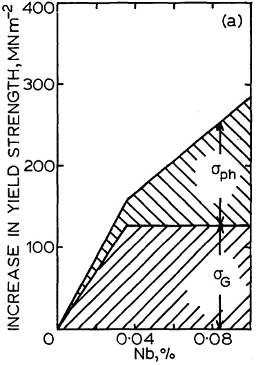

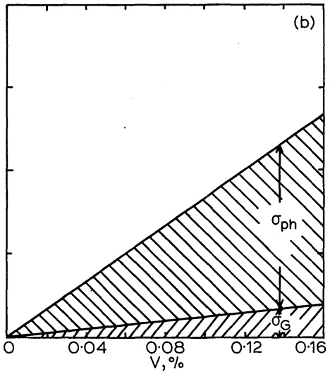

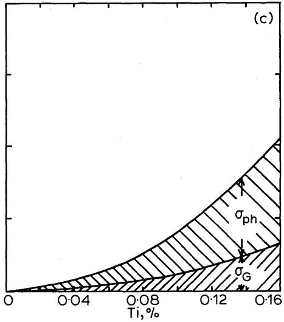

34 Correlation between alloy content and increase in yield strength as result of grain refinement $( \Delta \pmb { \sigma } _ { \pmb { 0 } } )$ and precipitation strengthening $( \Delta \sigma _ { \mathbf { p h } } )$ ; after Heisterkamp and Meyer121

In comparison with Nb, the effect of V on grain refinement is slight.25,57-59 The retarding effect of recrystallization was not observed24 at low temperatures in the γ-region.25,57-59 The addition of Ti slows down grain growth during slab reheating or after the recrystallization of γ.51 When added in large quantities (\~0.1%), Ti was reported to retard the recrystallization of γ.51,124 However, since Ti decreases the toughness of both base steel and the heat-affected-zone of weldment, its use is limited. In general, precipitates formed in γ at high temperatures are incoherent, causing little increase in strength. While precipitates formed in the ferrite matrix are coherent and raise the strength and transition temperature rapidly. Hashimoto et al.44,125 showed that straininduced precipitates raise strength, without impairing toughness, because of being incoherent but very fine. Controlled-rolled steel frequently makes combined use of Nb and V; Nb aids grain refining and V precipitation hardening.

Substitutional solute atoms contribute to the mechanical properties of controlled-rolled steel through solid-solution hardening, extension of the temperature range of controlled rolling, and refinement of transformation products owing to the lowering of the transformation temperature. It is worth noting that controlled rolling produces a ferrite grain structure by means of large deformation in the low-temperature γ-range and accelerating the γ to α transformation in steel with medium hardenability, which will become bainitic in the conventionally hot rolled or normalized condition.43 Therefore, excessive addition of alloying elements will suppress the α-transformation and the formation of a fine-grained ferrite structure, even in controlled-rolled steel.

Si exhibits a good strength—ductility relation at 0.3—0.5% in controlled-rolled steel as well as in the normalized type.126 Manganese is one of the essential elements in structural steel because it causes solid-solution hardening and ferrite grain refinement via lowering of the transformation temperature. The effect of Mn additions, up to a certain critical content, is to harden steel gradually by means of solid solution. However, further additions increase yield strength markedly due to transformation hardening.124 The addition of small amounts of Cr, Cu, and/or Ni (≤0.3%) has little effect on the properties of controlled-rolled steel. These elements are effective when used in combination with Nb and/or V, since they promote the formation of very fine precipitates via lower-

ing of the transformation temperature. As already mentioned, Cr suppresses the formation of a banded structure, thereby preventing the occurrence of separations. Mo causes an increase in strength mainly through transformation hardening. Mo is one of the essential elements in producing acicular ferrite steel,127,128 as referred to below.

## PRACTICE OF CONTROLLED ROLLING IN PRODUCTION MILL

In the production mill, factors governing the controlled-rolling process are inter-related and a variety of approaches can be used to attain the same objective. The important factors are as follows: (i) lowering of the slab-reheating temperature to obtain small and uniform γ-grain size29; (ii) γ-grain refinement via recrystallization; (iii) selection of a suitable pass schedule and, in particular, the amount of reduction per pass during the initial passes to obtain a fine and uniform recrystallized γ-grain structure; (iv) selection of temperature and time of delay between the recrystallization region and the non-recrystallization region22,36,39; and (v) a suitable amount of reduction and rolling temperature in the two-phase region. They are virtually equivalent to and interchangeable with each other, implying that a suitable combination of some of them would suffice to control-roll steel adequately. It is for this reason that the stressing factor differs from one investigator to another and from one mill to another. Taking into consideration the capacity, efficiency, cooling power, and stability of operation, each mill has its own controlled-rolling process.

The plate mill has difficulty in giving a sufficient amount of reduction per pass and, in particular, during the initial several passes of slab rolling. An improper pass schedule leads to mixed grain structure, causing deterioration in toughness. In order to overcome this difficulty, some investigators emphasize extremely large deformation in the non-recrystallization region.33,44 On the other hand, owing to a great deal of freedom in selecting the rolling temperature and distribution of reduction among the recrystallization, non-recrystallization, and twophase regions, the plate mill can meet freely a variety of requirements. In the hot-strip mill, the reduction per pass can be more than the critical one required for the completion of recrystallization in each pass, which makes reduction very easy in the recrystallization region, producing a finer and more uniform γ-grain structure than the plate mill. In the strip mill, however, the time and temperature of holding, distribution of reduction among the recrystallization, non-recrystallization, and two-phase regions, and selection of the finishing temperature are quite restricted. Thus, the plate mill and hot-strip mill have their advantages and disadvantages. The practice of controlled rolling is described briefly below.

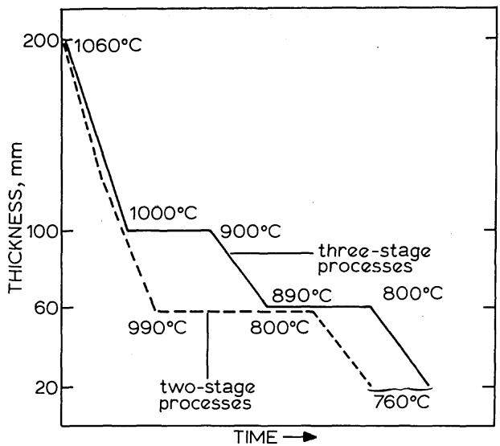

35 Simplified rolling schedules; conventional two-stage process and new three-stage process; after Lafrance et al.129

As shown in Fig. 1, controlled rolling in the plate mill is often carried out in terms of a 'rough-hold-finish'schedule: rolling passes in the rougher in the rapid-recrystallization region, a delay period, and rolling passes in the finisher. A delay is necessary to allow a specified total deformation to be introduced in the non-recrystallization region. There is a great possibility that during the holding period, recrystallization and subsequent rapid grain growth will take place22,39,129or partial recrystallization will occur38,39 whereby a mixed α-grain structure is formed, deteriorating toughness. Care must be taken, therefore, to ensure the required low finishing temperature while pre-venting rapid grain growth or partial recrystallization during holding.

Instead of the rough—holdfinish schedule, Jones and Rothwell22adopted a 'continuous' schedule involving reduction in the whole range, which produces a uniform, fine-grained structure. Figure 35 depicts the new rolling schedule,i.e.the three-stage rolling process as well as the standard two-stage process (rough—hold—finish), employed by USINOR, Dunkirk.129 During the delay time at high temperature in the standard two-stage process, recrystallization is rapid even in Nb steel, leading to a coarse-grained structure at the end of the delay time. In the three-stage process, the first delay time at high temperature leads to a coarse-grained structure. During the second delay time, recrystallization is sluggish so that the grain size at the end of rolling is finer for the threestage process than for the second stage.

At the British Steel Corporation, General Steels Division,36 to minimize recrystallization and grain growth during the delay period, the temperature at the commencement of the delay period is reduced by reducing the reheating temperature.

The temperature at the end of the delay period is controlled in order to allow a specific total deformation to be introduced without inducing an excessively high mill loading. Finish rolling at temperatures in the two-phase and/or α-regions is employed to increase strength. Total rolling deformation in the non-recrystallization region after the delay period is very important in order to achieve a uniform, fine-grained structure. To fulfil this requirement, the thickness of material at the commencement of re-rolling after the delay period is controlled at either three times or five times that of the final thickness.130-132

Controlled rolling in the hot-strip mill is very different from that in the plate mill: (i) rapid cooling on the run-out table after finish rolling is followed by slow cooling after coiling; (ii) both the rougher and finisher can carry out heavy reduction — during rolling in the finisher, the interpass time is very short, total rolling deformation in the finisher becoming almost one-pass reduction; (iii) rolling temperature and total reduction in the finisher encounter much restriction; (iv) rougher rolling can be regarded as deformation in the recrystallization region, and finisher rolling as deformation in the non-recrystallization region — the total reduction is overwhelmingly larger for rougher rolling than for finisher rolling and reduction per pass is large, which is suitable for achieving fine-grained γ through repeated recrystallization, resulting in a uniform, fine-grained α-structure; and (v) during holding at the coiling temperature, precipitation of Nb and V proceeds causing a large increase in yield strength. Rolling in the two-phase region is not always carried out, causing few separations. Because of large pre-cipitation hardening and few separations, the transition temperature is usually much higher for hotrolled strip than for plate. One example of a rolling schedule is shown in Fig. 36. By employing a low slab-reheating temperature and a heavy reduction in the rougher, they obtained a uniform, finegrained structure, even though the total reduction in the finisher (in the non-recrystallization region) was about 50%.

## ENLARGEMENT OF CONTROLLED-ROLLING PROCESS

As controlled rolling is known to be very useful, it has been applied to various fields and its application is being expanded.

## Acicular ferrite steel

Acicular ferrite, HSLA steel has been developed by the Climax Molybdenum Company.127,128,134 Lowcarbon (≤0.06%) Mn—Mo—Nb steel which will transform to upper bainite from undeformed or conventionally hot-rolled γ, transforms to acicular ferrite, when transformation is accelerated by controlled rolling. Figure 37 shows the acicular ferrite structure (Fig.37a) as well as the bainitic structure (Fig.37b). The acicular ferrite structure consists of fine non-equiaxed ferrite dispersed with cementite and martensite islands.

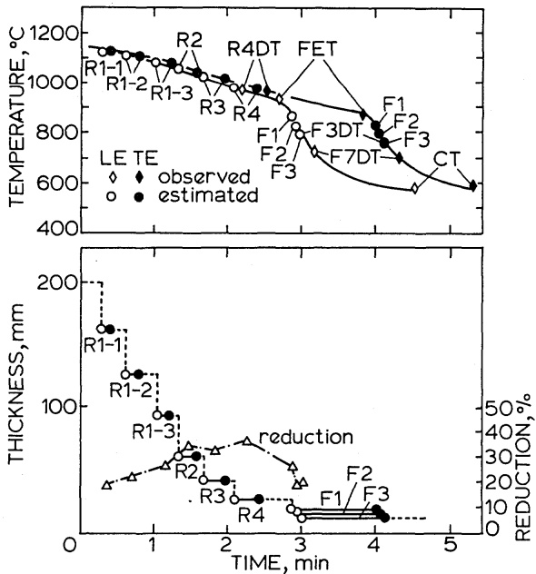

36 Typical processing schedule for hot-rolled strip (thickness 12.4 mm); after Nishida et al.133

The acicular ferrite is defined as a highly substructured, non-equiaxed phase that forms on continuous cooling by a mixed diffusion and shear mode of transformation at a temperature slightly higher than the upper bainite transformation range.127 Acicular ferrite is different from bainitic ferrite with respect to the prior γ-grainboundary network and cementite and martensite morphologies; in the bainitic structure, the prior γ-boundary network is retained and plate-like cementites are formed at coarse lath boundaries as well as the prior grain boundaries, whereas in the acicular ferrite structure the prior γ-grainboundary network is completely eliminated having a fine-grained structure, and small cementite and martensite islands are scattered throughout the matrix (see Fig. 37). Because of the above difference in microstructure between bainitic and acicular ferrite there is a distinct difference in the facet unit (effective grain size) which, in turn, causes a large difference in transition temperature between the two. In the bainitic structure, a facet unit is nearly equal to the prior γ-grain size, whereas in the acicular ferrite a facet unit is much smaller than the prior γ-grain size, giving a low transition temperature.

The fully acicular ferrite which, being free of polygonal ferrite, contains a small amount of cementite and martensite, exhibits high strength but poor toughness. A significant improvement in toughness can be obtained in the mixed structure of acicular plus fine-grained polygonal ferrite by lowering the finish-rolling temperature and by increasing the amount of deformation in the non-recrystallization region. The reason for the im-

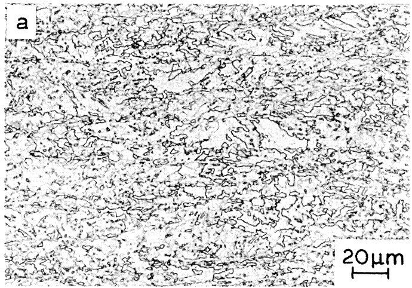

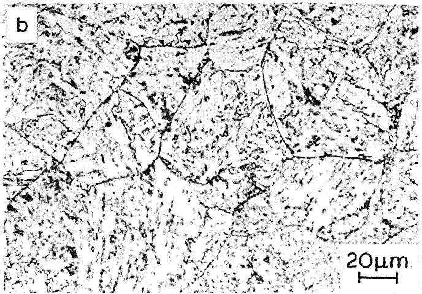

a acicular ferrite; b upper bainite

37 Structures in 0.06C—0.2Si—1.96Mn—0.42Mo— 0.06Nb steel

provement is grain refinement in the polygonal ferrite as well as acicular ferrite. As shown in Fig. 38, with the increase in the amount of deformation in the non-recrystallization region, finegrained polygonal ferrite increases in volume fraction at the expense of acicular ferrite which, in turn, causes an improvement in strength and low-temperature toughness. The optimum combination of strength and toughness is obtained with \~15% of polygonal ferrite. On the other hand, the introduction of coarse polygonal ferrite to acicular ferrite causes a deterioration in strength properties as well as impact properties. Causes of coarse polygonal-ferrite formation are insufficient hardenability and inadequate controlled rolling in terms of finish-rolling temperature, and the amount of deformation in the non-recrystallization region.

Another feature of acicular ferrite steel is continuous yielding followed by rapid work hardening, which is paramount to offsetting any loss in yield strength due to the Bauschinger effect.136 The Bauschinger effect has a pronounced effect on discontinuous yielding, polygonal steels.29

Controlled-rolled steels have been produced in large quantity for linepipe service in severe

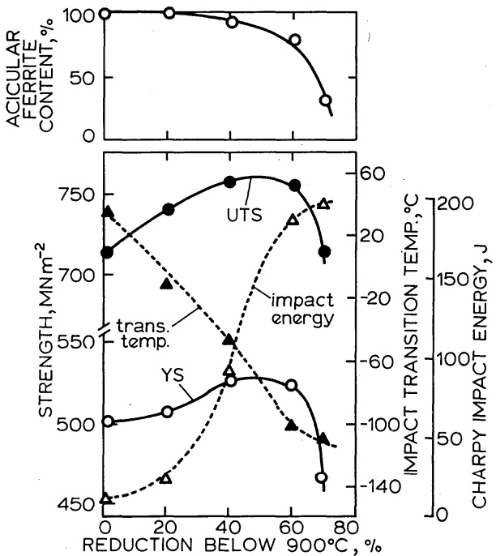

38 Acicular ferrite volume fraction, strengths, and Charpy impact properties plotted against amount of reduction in non-recrystallization region in 0.07C—2.0Mn—0.6Nb—0.5Mo acicular ferrite steel; after Tabata et al.135

Arctic environments. Controlled-rolled ferrite— pearlite steels have been produced up to the strength level of API X70 grade and up to \~40 mm thick. When the thickness is greater than that value, the controlled-rolling effect cannot be exerted over the whole thickness, thereby causing a coarse grain structure and deteriorating toughness at the midsection.

Acicular ferrite steel, which is produced by the combined effects of controlled rolling and transformation hardening, can overcome the above difficulty, giving greater thickness and higher strength.

## As-hot-rolled dual-phase steel

Dual-phase steel has a microstructure consisting of α-grains dispersed with fine martensite islands. It is characterized by continuous yielding followed by rapid work hardening, which results in a low yield but high tensile strength and large elongation. Dual-phase steel can be produced in the as-hotrolled condition by the combination of suitable chemical composition and rolling conditions.137-141When steel containing both strong ferrite formers like Si and transformation-delaying elements such as Cr, Mn, and/or Mo is cooled after hot rolling, the microstructure consists of α- and γ-phases. The latter is stabilized due to carbon enrichment and thereby transforms to martensite at low temperatures. When deformation is applied in the non-recrystallization region,

strain-assisted γ to α transformation occurs, thereby raising the α-transformation temperature on one hand and reducing the martensite transformation temperature on the other, which makes it easy to produce ferrite plus martensite dualphase steel.

## Controlled rolling of C—Mn steel

Gohda et $a l . ^ { 7 9 }$ and Hashimoto et al.80reported that when deformed in the two-phase region, Nbfree steel exhibits improvements in strength and toughness and, further, that heavy deformation in the two-phase region does not deteriorate toughness. Increase in strength by deformation in the two-phase region is due to either subgrain formation in the recovery region or dislocation hardening in the non-recovery region.80 The ease of recovery and occurrence of separations are responsible for good toughness of steel obtained by heavy deformation in the two-phase region.80 The effect of deformation in the two-phase region is essentially the same between Nb-bearing and Nbfree steels. The difference lies in the ease of recovery, which causes differences in the optimum conditions of finishing temperature and/or strain. Controlled-rolled C—Mn steel has started to be used as material for low-temperature service.

## Controlled rolling as pretreatment

By making use of grain-refining effect, controlled rolling is employed as a pretreatment before normalizing or quenching and tempering. This is based on the fact that a fine-grained structure produced by controlled rolling persists even in the reheated condition, probably due to the dispersion of fine Nb(C, N) precipitates. In Nb and 3. 5%Ni steels, controlled rolling plus normalizing produces higher strengths and better toughness than normalizing alone.142,143

Linepipe steel for Arctic use is usually produced by controlled rolling. However, when the thickness is increased too much the controlledrolling effect cannot be exerted over the whole thickness. Controlled rolling plus quenching and tempering produces much tougher material than the single process alone. The fine γ-grain size before quenching is responsible for this.144 Controlled rolling plus controlled cooling and controlled rolling followed by direct quenching have been tried.145

A new type of thermomechanical treatment has been proposed by Miyoshi et al.146 After controlled rolling, C-Mn and Nb steels are cooled below the ${ A r } _ { 1 }$ temperature and subsequently heated to $\sim 9 \dot { 0 } 0 ^ { \circ } \mathbf { C }$ , which produces a very finegrained γ-structure owing to the superimposed effects of controlled rolling, transformation, and normalizing. Fine-grained γ is once again controlled rolled, producing an extremely fine and uniform α-grain structure.

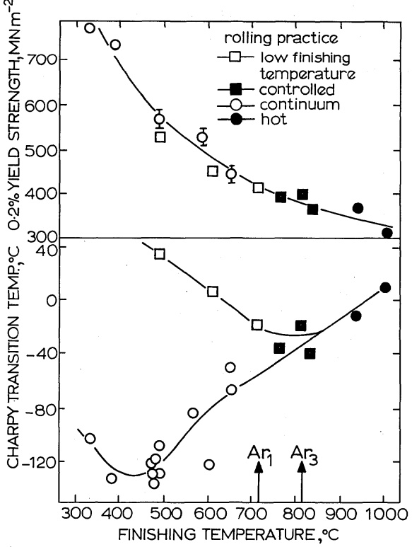

39 Effect of finishing temperature on yield strength and transition temperature of 0.05C—Mn—Nb steel plate rolled by various procedures; after Melloy and Dennison78

## Continuum rolling

So far, controlled rolling in the γ—α two-phase and/ or α regions has been described.Melloy and Dennison78 proposed continuum rolling, a unique thermomechanical process involving reductions of γ, γ + α, and α. Figure 39 shows that with continuum rolling the yield strength increases, while the transition temperature decreases with a decrease in finishing temperature in the α-region. Melloy and Dennison78attributed this desirable combination of increased strength and toughness to (i) grain refinement of both γ and α by heavy, repeated deformations; (ii) a dynamic recovery that produces a fine polygonal substructure; and (iii) cube-on-corner crystallographic texturing that results from the deformation process.

The results were obtained in extra-low-carbon steel but whether or not the same results will be obtained in low-alloy steels remains unsolved. It is also difficult to apply this process for practical use.

## SUMMARY

A review has been made of the controlled rolling of steel, covering such aspects as its historical development, the fundamentals of controlled rolling, recrystallization behaviour in Nb steel, the formation and role of deformation bands, properties of controlled-rolled steels, effects of alloying elements, the practice of controlled rolling in production mills, and future developments.

Rolling passes in the low-temperature range just above $A r _ { 3 }$ were made to refine the grain structure and thereby to enhance both strength and toughness in as-rolled steel. Their influence was found to be very beneficial when applied to Nb steels. This was the beginning of controlled rolling.

Controlled rolling consists of three stages: (i) stage 1 is deformation in the recrystallization region, where coarse austenite is refined by recrystallization but still transforms to a relatively coarse ferrite; (ii) stage 2 is deformation in the non-recrystallization region, where deformation bands are formed in unrecrystallized austenite ferrite nucleates on the deformation bands as well as on the austenite grain boundaries, giving fine ferrite; and (iii) stage 3 is deformation in the austenite—ferrite two-phase region — deformation in this region continues stage 2 and also deforms the ferrite, producing a substructure. Additional strengthening is obtained by the subgrain hardening.

The fundamental difference between conventionally hot-rolled and controlled-rolled steels lies in that in the former ferrite nucleates exclusively at austenite grain boundaries, whereas in the latter ferrite nucleation occurs in the grain interiors as well as the grain boundaries. This brings about a large difference in the final ferrite grain size between the two.

Controlled-rolled steel has higher strength and a lower transition temperature than conventionally hot-rolled or normalized steel. In controlled-rolled steel, however, plane anisotropy in the mechanical properties and through-thickness embrittlement are caused by crystallographic texture development, manganese sulphide inclusions flattened by low-temperature rolling, and others. Through-thickness embrittlement is the main cause of the occurrence of separations which appear in the fractured Charpy specimens in the longitudinal and transverse directions. Very low transition temperatures in the longitudinal and transverse directions are achieved by sacrificing toughness in the through-thickness direction. Several procedures are proposed to eliminate separations.

Recrystallization behaviour is divided into the recovery, partial recrystallization, and complete recrystallization regions. To obtain uniform, finegrained austenite and ferrite structures, at least one rolling pass must be performed successively in a strain range larger than that for the partialrecrystallization region. The retardation mechanism of austenite recrystallization due to Nb is explained in terms of strain-induced precipitation of fine Nb(C, N) and/or solute-drag effect. Deformation bands generated by controlled rolling divide an austenite grain into several blocks, since they are equivalent to austenite grain boundaries

with regard to ferrite-nucleation potential. In controlled-rolled steels, the microstructure consists of fine-grained polygonal ferrite or a mixture of polygonal ferrite grains and subgrains, depending on whether deformation is finished in the austenite or austenite—ferrite region. Taking microstructural change into consideration, strengthening and toughening mechanisms are presented. Transition temperature is determined mainly by the following two contradictory factors; hardening due to precipitation, dislocations, etc., and grain refinement and separations.

Although there are many processing variables governing controlled rolling, some of them are virtually equivalent to and interchangeable with each other. It is for this reason that the stressing factor is different from one mill to another. As controlled rolling is known to be very useful, it has been applied to various fields and its application is being expanded. Acicular ferrite and ferrite plus martensite dual-phase steels are produced by the combination of suitable chemical composition and controlled rolling. By making use of the grainrefining effect, controlled rolling is employed as pretreatment before normalizing or quenching.

## ACKNOWLEDGMENTS

The author is very grateful to T. Enami, M. Kimura, and Y. Saito for their helpful discussions and assistance in the preparation of the manuscript.

## REFERENCES

1. A. Arrowsmith: J.Iron Steel Inst., 1924, 110, 317-319.

2. W.J.Berry: Iron Coal Trade Rev., 1928, 66, 900.

3. H.Hanemann and F.Lucke: Stahl Eisen, 1925, 45,1117-1122.

4. W.Barr and C.F. Tipper: J.Iron Steel Inst., 1947,157,223—238.

5. I. M. Mackenzie: J. West Scotland Iron Steel Inst., 1952—53,60,224–258.

6. J. M. Hodge, R. D. Manning, and H. M. Reichhold: Trans. AIME, 1949, 185, 233—240.

7. R. H. Frazier, F. W. Boulger, and C. H. Lorig: Iron Steel Eng., Oct. 1956, 33, 67—77.

8. E.O. Hall: Proc. Phys. Soc., 1951, 64B, 747-753.

9. J.Heslop and N.J. Petch: Philos. Mag., 1958, 3,1128—1136.

10. H.-J. Wiester, W. Dahl, and H.Hengstenberg: Stahl Eisen, 1962, 82, 1176—1186.

11. M. Haneke: Arch. Eisenhittenwes., 1962, 33, 233-239.

12. R.W.Vanderbeck: Weld.J.,1958, 37, 114S— 116S.

13. C.A. Beiser: Preprint 138, Annual Convention ASM, Chicago, 1959.

14. Great Lakes Steel Corp.: Steel, 1960, 116, 102.

15. T. M. Norén: Ship Structure Committee Special Report, 1963, SSC—154.

16. W.B.Morrison: J.Iron Steel Inst., 1963, 201, 317-325.

17. K.J.Irvine: 'Strong tough structural steels', 1—10; 1967, London, The Iron and Steel Institute.

18. W. E. Duckworth, R. Phillips, and J. A. Chapman: J. Iron Steel Inst., 1965, 203, 1108— 1114.

19. W.E.Duckworth: Iron Steel, 1964,37, 585— 588.

20. R. Phillips and J. A. Chapman: J. Iron Steel Inst., 1966, 204, 615—622.

21. J.J.Irani, D.Burton, J. D.Jones, and A.B. Rothwell: 'Strong tough structural steels', 110—122; 1967, London, The Iron and Steel Institute.

22. J.D.Jones and A.B.Rothwell: 'Deformation under hot working conditions', 78—82; 1968, London, The Iron and Steel Institute.

23. R. Priestner, C.C. Earley, and J.H. Rendall: J. Iron Steel Inst., 1968, 206, 1252–1262.

24. K.J.Irvine, T. Gladman, J.Orr, and F. B. Pickering: J. Iron Steel Inst., 1970, 208, 717— 726.

25. I. Kozasu, T. Shimizu, and H.Kubota: Trans. Iron Steel Inst. Jpn, 1971, 11, 367–375.

26. H.Sekine and T.Maruyama: 'The microstructure and design of alloys', Vol.1, 85—88; 1974, London, The Metals Society.

27. T. Tanaka, N. Tabata, T. Hatomura, and C. Shiga: 'Microalloying '75', 107–119; 1977, New York, Union Carbide Corporation.

28. T. Tanaka: 'Hot deformation of steels', 23— 49; 1980, Tokyo, The Iron and Steel Institute of Japan.

29. T. Tanaka, T. Funakoshi, M. Ueda, T. Yasuda, J. Tsuboi, and C. Utahashi: 'Microalloying '75', 399—409; 1977, New York, Union Carbide Corporation.

30. A. le Bon, J. Rofes-Vernis, and C. Rossard: Mém. Sci. Rev. Métall., 1973, 70, 577—588.

31. J.J.Jonas and I.Weiss: Met. Sci., 1979, 13, 238-245.

32. H.Sekine and T. Maruyama: Trans. Iron Steel Inst. Jpn, 1976, 16, 427—436.

33. M. Fukuda, T. Hashimoto, and K. Kunishige: 'Microalloying '75', 136—150; 1977, New York, Union Carbide Corporation.

34. I. Kozasu, C. Ouchi, T. Sanpei, and T. Okita: 'Microalloying '75', 120—135; 1977, New York, Union Carbide Corporation.

35. T.Tanaka and N.Tabata: Tetsu-to-Hagané, 1978,64,1353—1362.

36. J.H. Little, J.A. Chapman, W.B.Morrison, and B. Mintz: 'The microstructure and design of alloys', Vol. 1, 80—84; 1974, London, The Metals Society.

37. T. Coleman, D. Dulieu, and A. Gouch: 'The microstructure and design of alloys', Vol.1, 70—74; 1974, London, The Metals Society.

38. J.D.Baird and R.R. Preston: 'Processing and properties of low-carbon steel',1—46; 1973, New York, Metallurgical Society of AIME.

39. A.le Bon and L. N.de Saint-Martin: 'Microalloying '75', 90—99; 1977, New York, Union Carbide Corporation.

40. H. Matsubara, T. Osuka, I. Kozasu, and K. Tsukada: Trans. Iron Steel Inst. Jpn, 1972, 12, 435-443.

41. H.Sekine and T.Maruyama: Seitetsu Kenkyu 1976,289,11920—11937.

42. T. Gladman and D.Dulieu: Met. Sci., 1974, 8, 167-176.

43. T.Tanaka: 'Hot deformation of steels', 55— 72; 1979, Tokyo, The Iron and Steel Institute of Japan.

44. M. Fukuda, T. Hashimoto, and K. Kunishige: Tetsu-to-Hagané, 1972, 58, 1832—1847.

45. T. Tanaka, T. Hatomura, and N. Tabata: Kawasaki Steel Tech. Rep., 1974, 6, 522—537.

46. W.J. McG. Tegart and A.Gittins: 'The hot deformation of austenite', 1—67; 1977, New York, American Institute of Mining, Metallurgical and Petroleum Engineers.

47. R.A.P.Djaic and J.J.Jonas: Metall. Trans., 1973,4,621—624.

48. H.J. McQueen: J. Met., April 1968, 20, 31—38.

49. C. Ouchi, T. Okita, T. Sanpei, and I. Kozasu: Tetsu-to-Hagané, 1977, 63, A53—A56.

50. D.J.Towle and T.Gladman: Met.Sci., 1979, 13,246—256.

51. C. Ouchi, T. Sanpei, T. Okita, and I. Kozasu: 'The hot deformation of austenite', 316—340; 1977, New York, American Institute of Mining, Metallurgical and Petroleum Engineers.

52. T.Hatomura and T.Tanaka: Tetsu-to-Hagané, 1976, 62, S468.

53. T. Tanaka, T.Hatomura, and N.Tabata: Tetsuto-Hagané, 1976, 62, S206.

54. I. Kozasu: Trans. Iron Steel Inst. Jpn, 1972, 12, 241-250.

55. Y.Ohmori: Nippon Kinzoku Gakkaishi, 1966, 30,1164-1167.

56. M.Lamberigts and T. Greday: 'The hot deformation of austenite', 286—315; 1977, New York, American Institute of Mining, Metallurgical and Petroleum Engineers.

57. J.N.Cordea and R.E.Hook: Metall. Trans., 1970,1,111—118.

58. M. J.Stewart: 'The hot deformation of astenite', 233—249; 1977, New York, American Institute of Mining, Metallurgical and Petroleum Engineers.

59. A.B. Rothwell: Mém. Sci. Rev. Métall., 1972, 69,413-424.

60. T.L. Capeletti, L. A.Jackman, and W.J. Childs: Metall. Trans., 1972, 3, 789—796.

61. R. Priestner and M.S. Biring: Met. Sci.J., 1973,7,60—64.

62. R. Priestner: Rev. Métall., 1975, 72, 285—296.

63. T. Greday and M. Lamberigts: 'Microalloying '75', 172-187; 1977, New York, Union Carbide Corporation.

64. A. le Bon, J. Rofes-Vernis, and C. Rossard: Met. Sci., 1975, 9, 36—40.

65. O. Akisue and K.Takashina: Trans.Jpn Inst. Met., 1973, 14, 489—495.

66. S.Sekino, N.Mori, and S. Tamukai: Tetsu-to-Hagané, 1972,58, 1044—1053.

67. R. Coladas, J. Masounave, and J.-P. Bailon: 'The hot deformation of austenite', 341—383; 1977, New York, American Institute of Mining, Metallurgical and Petroleum Engineers.

68. H.Watanabe, Y.E. Smith, and R. D. Pelke: 'The hot deformation of austenite', 140—168; 1977, New York, American Institute of Mining, Metallurgical and Petroleum Engineers.

69. A.T. Davenport, R. E. Miner, and R. A. Kot: 'The hot deformation of austenite', 186—203; 1977, New York, American Institute of Mining, Metallurgical and Petroleum Engineers.

70. T. G.Oakwood, W. E. Heitman, and E.S. Madrzyk: 'The hot deformation of austenite', 204–232; 1977, New York, American Institute of Mining, Metallurgical and Petroleum Engineers.

71. I.Weiss and J.J.Jonas: Metall. Trans.,1979, 10A, 831-840.

72. K.J.Irvine and T.N. Baker: Met. Sci., 1979, 13,228-237.

73. H. Kaji, M. Katsumata, M. Machida, and S. Kinoshita: Tetsu-to-Hagané, 1974, 60, S295.

74. H. Sekine, T. Maruyama, and Y. Kawashima: Tetsu-to-Hagané, 1974, 60, S557.

75. W. B. Morrison and J. A. Chapman: Philos. Trans.R. Soc., 1976, 282A, (1307), 289—303.

76. E.L. Brown, A.J. DeArdo, and J.H.Bucher: 'The hot deformation of austenite', 250—285; 1977, New York, American Institute of Mining, Metallurgical and Petroleum Engineers.

77. R. Priestner and E.de los Rios: 'Heat treatment '76', 129—134; 1976, London, The Metals Society.

78. G.F.Melloy and J.D.Dennison: 'The microstructure and design of alloys', Vol.1, 60–64; 1974, London, The Metals Society.

79. S. Gohda, K. Watanabe, and Y. Hashimoto: Tetsu-to-Hagané, 1979, 65, 1400—1409.

80. T. Hashimoto, T. Sawamura, and H. Ohtani: Tetsu-to-Hagané, 1979,65,1425—1433.

81. C.R.Mackenzie and R.W.Young: J.Iron Steel Inst., 1971, 209, 918—920.

82. Y.Saito and T.Tanaka: Tetsu-to-Hagané, 1975, 61, S211.

83. Y.E.Smith and C.A.Siebert: Metall. Trans., 1971,2,1711—1725.

84. T. Terázawa, H. Higashiyama, and S. Sekino: 'Toward improved ductility and toughness', 101—117; 1972, Tokyo, Climax Molybdenum Company (Japan) Ltd.

85. A.Jones and B.Walker: British Steel Corporation Open Report, SM/612/A, 1974.

86. S. Matsuo, T. Maruyama, and H. Sekine: Tetsu-to-Hagané, 1974, 60, S559.

87. F.Terasaki and T.Kaneko: Tetsu-to-Hagané, 1975, 61, S208.

88. B.L.Bramfitt and A.R.Marder: 'Processing and properties of low-carbon steel', 191-224; 1973, New York, American Institute of Mining, Metallurgical and Petroleum Engineers.

89. G.R.Speich and D.S.Dabkowski: 'The hot deformation of austenite', 557—598; 1977, New York, American Institute of Mining, Metallurgical and Petroleum Engineers.

90. I. Kozasu and H. Inagaki: Nippon Kinzoku Gakkai Kaiho, 1976,15, 261—270.

91. T.Yutori and R.Ogawa: Tetsu-to-Hagané, 1979,65,1747—1755.

92. H. Inagaki, K. Kurihara, and I. Kozasu: Tetsuto-Hagané, 1975, 61, 991—1011.

93. T.Tanaka: Nippon Kinzoku Gakkai Kaiho, 1978,17,104-110.

94. I. Kozasu: '36th and 37th Nishiyama memorial lecture', 65—96; 1975, Tokyo, The Iron and Steel Institute of Japan.

95. W.B.Morrison: Met. Technol., 1975,2, 33—41.

96. E. Miyoshi, M. Fukuda, H. Iwanaga, and T. Okazawa: Proc. Conf. 'Crack propagation in pipelines', paper no. 4, 26—27 March 1974, Newcastle upon Tyne, The Institution of Gas Engineers.

97. E. Miyoshi, T. Tanaka, M. Fukuda, H. Iwanaga, and T.Okazawa: Tetsu-to-Hagané, 1976, 62, 688-695.

98. F.D.Kazinczy and W.A.Backofen: Trans. ASM, 1961, 53, 55—73.

99. G.Baldi and G.Buzzichelli: Met. Sci.,1978, 12,459-472.

100. J.F.Knott: 'Effect of second-phase particles on the mechanical properties of steel', 44 53; 1971, London, The Iron and Steel Institute.

101. J. D.Embury, N.J. Petch, A.E. Wraith, and E.S. Wright: Trans. AIME, 1967, 239, 114—118.

102. I. Kozasu and H. Kubota: Trans. Iron Steel Inst. Jpn, 1971, 11, 321—330.

103. E. Miyoshi, M. Fukuda, T. Hashimoto, and Y. Asai: Tetsu-to-Hagané, 1974, 60, S220.

104. R. Schofield, G. Rountree, N. V.Sarma, and R.T. Weiner: Met. Technol., 1974,1, 325—331.

105. J. D. Embury and K. Cooper: Can.Metall. Q., 1975,14,69—83.

106. E.Hornbogen and K.D.Beckmann: Arch. Eisenhüttenwes., 1976,47, 553—558.

107. M. Iino, H. Mimura, and N. Nomura: Trans. Iron Steel Inst. Jpn, 1977, 17, 450—458; 1978, 18,33-42.

108. M. Fukuda, K. Kunishige, and S. Sugizawa: Tetsu-io-Hagané, 1978, 64, 740—748.

109. E. A. Almond: Metall. Trans., 1970, 1, 2038— 2041.

110. T. Mori, T. Enami, T. Funakoshi, and R.Okabe: Tetsu-to-Hagané, 1977, 63, S796.

111. L. Luyckx, J. R. Bell, A. McLean, and M. Korchynsky: Metall. Trans., 1970, 1, 3341— 3350.

112. H.Pirchner and W.Klapar: 'Microalloying '75', 232—240; 1977, New York, Union Carbide Corporation.

113. A.Brownrigg and F.M.Chambers: J.Iron Steel Inst., 1970, 208, 1078—1082.

114. O. Haida, T. Emi, K. Sanbongi, T. Shiraishi, and A. Fujiwara: Tetsu-to-Hagané, 1978, 64, 1538— 1547.

115. T.N.Baker and N.A.McPherson: Met.Sci., 1979,13, 611-618.

116. S. Matsuda, T. Inoue, H. Mimura, and Y. Okamura:'Toward improved ductility and toughness', 45—66; 1972, Tokyo, Climax Molybdenum Company (Japan) Ltd.

117. T.Kunitake, F.Terasaki, Y.Ohmori, and H. Ohtani: 'Toward improved ductility and toughness', 83—100; 1972, Tokyo, Climax Molybdenum Company (Japan) Ltd.

118. A. Kamada, N. Koshizuka, and T. Funakoshi: Trans. Iron Steel Inst. Jpn, 1976, 16, 407—416.

119. T. Gladman, D. Dulieu, and I. D. McIvor: 'Microalloying '75', 32—54; 1977, New York, Union Carbide Corporation.

120. F.B.Pickering: 'Microalloying '75', 9—31; 1977, New York, Union Carbide Corporation.

121. F.Heisterkamp and L.Meyer: Thyssenforschung, 1971, 3,44—65.

122. L.Meyer, H.E.Bühler, and F.Heisterkamp: Thyssenforschung, 1971, 3, 8—43.

123. D.Webster and J.H. Woodhead: J.Iron Steel Inst., 1964, 202, 987–994.

124. M. Durbin and P.R.Krahe: 'Processing and properties of low-carbon steel', 109—132; New York, American Institute of Mining, Metallurgical and Petroleum Enginéers.

125. K. Kunishige, T. Hashimoto, and T. Yukitoshi: Tetsu-to-Hagané, 1980, 66, 63—72.

126. K. Imai and I.Kozasu: Tetsu-to-Hagané, 1974 60, S566.

127. Y.E.Smith, A. P. Coldren, and R. L. Cryderman: 'Toward improved ductility and toughness', 119—142; 1972, Tokyo, Climax Molybdenum Company (Japan) Ltd.

128. A. P. Coldren, Y. E. Smith, and R. L. Cryderman: 'Processing and properties of lowcarbon steel', 163-189; 1973, New York, American Institute of Mining, Metallurgical and Petroleum Engineers.

129. M. Lafrance, F. Caron, G. Lamant, and J. Leclerc: 'Microalloying '75', 367—374; 1977, New York, Union Carbide Corporation.

130. M. Civallero and C.Parrini: '16th mechanical working and steel processing', 413—436; 1974, New York, Iron and Steel Society of AIME.

131. T. Yamaguchi, T. Osuka, T. Taira, and N. Iwasaki: 'Microalloying '75', 415—424; 1977, New York, Union Carbide Corporation.

132. K. D. Taeffner, G. Gorges, M. A. Haneke, and W.T. Recknagel: 'Microalloying '75', 425— 434; 1977, New York, Union Carbide Corporation.

133. M. Nishida, T. Kato, N. Ohashi, and T.Mori: Tetsu-to-Hagané, 1977, 63, 1116—1125.

134. A. P. Coldren and J. L. Mihelich: 'Molybdenum-containing steels for gas and oil industry applications - a state-of-the-art review', 14—28; Greenwich, Conn., Climax Molybdenum Company.

135. N. Tabata, C. Shiga, A. Kamada, and T. Tanaka: Tetsu-to-Hagané, 1977, 63, S797.

136. G.Tither and M.Lavite: J.Met., Sept.1975, 27,15—23.

137. W.R.Cribb and J.M.Rigsbee: 'Structure and properties of dual-phase steels', 91-117; 1979, New York, American Institute of